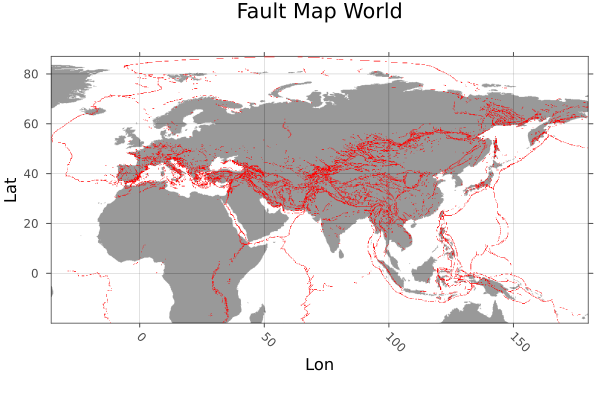

```@meta
EditURL = "../../../tutorials/Tutorial_FaultDensity.jl"
```

# Fault Density Map

## Goal
In this tutorial, Fault Data is loaded as Shapefiles, which is then transformed to raster data. With the help of that a fault density map of Europe is created.

## 1. Load Data

Load packages:

```julia
using GeophysicalModelGenerator, Shapefile, Plots, Rasters, GeoDatasets, Interpolations
```

Data is taken from "Active Faults of Eurasia Database AFEAD v2022" DOI:10.13140/RG.2.2.25509.58084
You need to download it manually (as it doesn't seem to work automatically), and can load the following file:

```julia
File   = "AFEAD_v2022/AFEAD_v2022.shp"
```

Load data using the `Shapefile` package:

```julia
table  = Shapefile.Table(File)
geoms  = Shapefile.shapes(table)
CONF   = table.CONF
```

Raster the shapefile data

```julia
ind    = findall((table.CONF .== "A") .| (table.CONF .== "B") .| (table.CONF .== "C"))
faults = Shapefile.Handle(File).shapes[ind]
faults = rasterize(last,faults; res=(0.12,0.12), missingval=0, fill=1, atol = 0.4, shape=:line)
lon    = faults.dims[1]
lat    = faults.dims[2]
```

Download coastlines with `GeoDatasets`:

```julia
lonC,latC,dataC = GeoDatasets.landseamask(;resolution='l',grid=10)
```

Interpolate to fault grid

```julia
itp        = linear_interpolation((lonC, latC), dataC)
coastlines = itp[lon.val,lat.val]
coastlines = map(y -> y > 1 ? 1 : y, coastlines)
```

Plot the fault data

```julia
heatmap(lon.val,lat.val,coastlines',legend=false,colormap=cgrad(:gray1,rev=true),alpha=0.4);
plot!(faults; color=:red,legend = false,title="Fault Map World",ylabel="Lat",xlabel="Lon")
```



Restrict area to Europe

```julia
indlat = findall((lat .> 35) .& (lat .< 60))
Lat    = lat[indlat]
indlon = findall((lon .> -10) .& (lon .< 35))
Lon    = lon[indlon]
data   = faults.data[indlon,indlat]
```

Create GeoData from restricted data

```julia
Lon3D,Lat3D, Faults = LonLatDepthGrid(Lon,Lat,0);
Faults[:,:,1]       = data
Data_Faults         = GeoData(Lon3D,Lat3D,Faults,(Faults=Faults,))
```

## 2. Create Density Map
Create a density map of the fault data. This is done with the `CountMap` function. This function takes a specified field of a 2D `GeoData` struct and counts the entries in all control areas which are defined by steplon (number of control areas in lon direction) and steplat (number of control areas in lat direction). The field should only consist of 0.0 and 1.0 and the steplength. The final result is normalized by the highest count.

```julia
steplon  = 188
steplat  = 104
cntmap   = CountMap(Data_Faults,"Faults",steplon,steplat)
```

Plot the density map with coastlines

```julia
lon = unique(cntmap.lon.val)
lat = unique(cntmap.lat.val)
coastlinesEurope = itp[lon,lat]
coastlinesEurope = map(y -> y > 1 ? 1 : y, coastlinesEurope)
```

Plot this using `Plots.jl`:

```julia
heatmap(lon,lat,coastlinesEurope',colormap=cgrad(:gray1,rev=true),alpha=1.0);
heatmap!(lon,lat,cntmap.fields.CountMap[:,:,1]',colormap=cgrad(:batlowW,rev=true),alpha = 0.8,legend=true,title="Fault Density Map Europe",ylabel="Lat",xlabel="Lon")
```


---

*This page was generated using [Literate.jl](https://github.com/fredrikekre/Literate.jl).*

