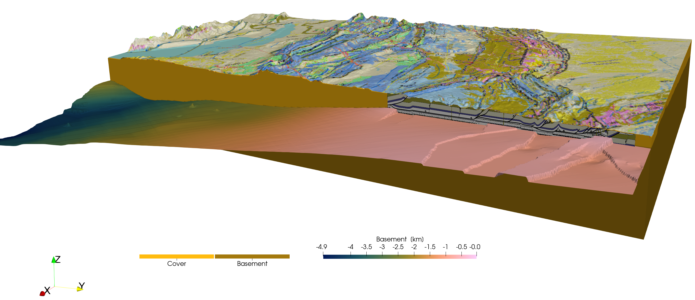

```@meta
EditURL = "../../../tutorials/Tutorial_Jura.jl"
```

# Create a 3D model of the Jura mountains

## Aim
In this tutorial, your will learn how to use drape a geological map on top of a digital topography model, import GeoTIFF surfaces and add cross-sections from screenshots to the model setup.

## 1. Load data

We start with loading the required packages, which includes `GMT` to download topography (an optional dependency for `GeophysicalModelGenerator`)

```julia
using GeophysicalModelGenerator, GMT
```

Download the topography with:

```julia
Topo = ImportTopo(lat=[45.5,47.7], lon=[5, 8.1], file="@earth_relief_03s.grd")
```

Next, we drape the geological map on top of the geological map.
The geological map was taken from the [2021 PhD thesis of Marc Schori](https://folia.unifr.ch/unifr/documents/313053) and saved as png map.
We downloaded the pdf map, and cropped it to the lower left and upper right corners.
The resulting map was uploaded to zenodo; it can be downloaded with

```julia
download_data("https://zenodo.org/records/10726801/files/SchoriM_Encl_01_Jura-map_A1.png", "SchoriM_Encl_01_Jura-map_A1.png")
```

We also used a slightly larger version of the map along with the online tool [https://apps.automeris.io](https://apps.automeris.io) to extract the location of the corners (using the indicated blue lon/lat values on the map as reference points).
This results in:

```julia
lowerleft  = [4.54602510460251, 45.27456049638056, 0.0]
upperright = [8.948117154811715, 47.781282316442606, 0.0]
```

We can now import the map with the `Screensho_To_GeoData` function:

```julia
Geology  = Screenshot_To_GeoData("SchoriM_Encl_01_Jura-map_A1.png", lowerleft, upperright, fieldname=:geology_colors) # name should have "colors" in it
```

You can "drape" this image on the topographic map with

```julia
TopoGeology = drape_on_topo(Topo, Geology)
```

```julia
GeoData
  size      : (3721, 2641, 1)
  lon       ϵ [ 5.0 : 8.1]
  lat       ϵ [ 45.5 : 47.7]
  depth     ϵ [ 0.157 : 4.783]
  fields    : (:Topography, :geology_colors)
```

In the same PhD thesis, Schori also reconstructed the depth of various layers within the Jura.
The data of his thesis are uploaded to [https://doi.org/10.5281/zenodo.5801197](https://doi.org/10.5281/zenodo.5801197).
Here, we use the basement topography as an example (`/03_BMes_top-basement/BMes_Spline.tif`), which is in the `GeoTIFF` format that contains coordinates.
Unfortunately, there are a lot of coordinate systems and in the thesis of Schori, a mixture of longitude/latitude (`longlat`) and a Swiss reference system is used.
Within `GeophysicalModelGenerator`, we need a `longlat` coordinate system. It is quite easy to convert one to the other with the open-source [QGIS](https://qgis.org/) package.
We did this and saved the resulting image in Zenodo:

```julia
download_data("https://zenodo.org/records/10726801/files/BMes_Spline_longlat.tif", "BMes_Spline_longlat.tif")
```

Now, import the GeoTIFF as:

```julia
Basement = ImportGeoTIFF("BMes_Spline_longlat.tif", fieldname=:Basement, removeNaN_z=true)
```

the `removeNaN_z` option removes `NaN` values from the dataset and instead uses the z-value of the nearest point.
That is important if you want to use this surface to generate a 3D model setup (using `belowSurface`, for example).

The thesis also provides a few interpreted vertical cross-sections. As before, we import them as a screenshot and estimate the lower-left and upper right corners.
In this particular case, we are lucky that the `lon/lat` values are indicated on the cross-section.
Often that is not the case and you have to use the mapview along with the digitizer tool described above to estimate this.

As example, we use the cross-section

```julia
download_data("https://zenodo.org/records/10726801/files/Schori_2020_Ornans-Miserey-v2_whiteBG.png", "Schori_2020_Ornans-Miserey-v2_whiteBG.png")
Corner_LowerLeft = (5.92507, 47.31300, -2.0)
Corner_UpperRight = (6.25845, 46.99550, 2.0)
CrossSection_1 = Screenshot_To_GeoData("Schori_2020_Ornans-Miserey-v2_whiteBG.png", Corner_LowerLeft, Corner_UpperRight) # name should have "colors" in it
```

Note that we slightly modified the image to save it with a white instead of a transparent background

# 2. Project the data to a cartesian grid
At this stage, we have all data in geographic coordinates. In most cases it is more useful to have them in cartesian coordinates.
Moreover, the resolution of the grids is different. Whereas the `TopoGeology` has a size of `(3721, 2641, 1)`,  `Basement` has size `(2020, 1751, 1)`.
It is often useful to have them on exactly the same size grid

We can do this in two steps:
First, we define a `ProjectionPoint` along which we perform the projection

```julia
proj = ProjectionPoint(Lon=6, Lat=46.5)
```

We can simply transfer the TopoGeology map to Cartesian values with:

```julia
Convert2CartData(Topo,proj)
```

```julia
CartData
    size    : (3721, 2641, 1)
    x       ϵ [ -82.31272066158422 : 162.66627630405523]
    y       ϵ [ -115.08628070208057 : 136.73428093825373]
    z       ϵ [ 0.157 : 4.783]
    fields  : (:Topography,)
```

The problem is that the result is not strictly orthogonal, but instead slightly curved.
That causes issues later on when we want to intersect the surface with a 3D box.
It is therefore better to use the `ProjectCartData` to project the `GeoData` structure to a `CartData` struct.
Let's first create this structure by using `x`,`y` coordinates that are slightly within the ranges given above:

```julia
TopoGeology_cart = CartData(XYZGrid(range(-70,150,length=3500), range(-105,130,length=2500), 0.0))
```

```julia
CartData
    size    : (3500, 2500, 1)
    x       ϵ [ -75.0 : 160.0]
    y       ϵ [ -110.0 : 135.0]
    z       ϵ [ 0.0 : 0.0]
    fields  : (:Z,)
```

Next, we project the data with:

```julia
TopoGeology_cart = ProjectCartData(TopoGeology_cart, TopoGeology, proj)
```

```julia
CartData
    size    : (3500, 2500, 1)
    x       ϵ [ -80.0 : 160.0]
    y       ϵ [ -110.0 : 135.0]
    z       ϵ [ 0.16119615440200846 : 4.776083480822139]
    fields  : (:Topography, :geology_colors)
```

And we can do the same with the basement topography

```julia
Basement_cart = ProjectCartData(TopoGeology_cart, Basement, proj)
```

```julia
CartData
    size    : (3500, 2500, 1)
    x       ϵ [ -80.0 : 160.0]
    y       ϵ [ -110.0 : 135.0]
    z       ϵ [ -6.049924561684904 : 0.8030737304687502]
    fields  : (:Basement,)
```

Finally, we can also transfer the cross-section to cartesian coordinates. As this is just for visualization, we will
use `Convert2CartData` in this case

```julia
CrossSection_1_cart = Convert2CartData(CrossSection_1,proj)
```

for visualization, it is nice if we can remove the part of the cross-section that is above the topography.
We can do that with the `belowSurface` routine which returns a Boolean to indicate whether points are below or above the surface

```julia
below = belowSurface(CrossSection_1_cart, TopoGeology_cart)
```

We can add that to the cross-section with:

```julia
CrossSection_1_cart = AddField(CrossSection_1_cart,"rocks",Int64.(below))
```

Note that we transfer the boolean to an integer

Let's have a look at this in Paraview:

```julia
Write_Paraview(Basement_cart,"Basement_cart")
Write_Paraview(TopoGeology_cart,"TopoGeology_cart")
Write_Paraview(CrossSection_1_cart,"CrossSection_1_cart")
```

The result looks like:


## 3. Geological block model
Yet, if you want to perform a numerical simulation of the Jura, it is more convenient to rotate the maps such that we can perform a simulation perpendicular to the strike of the mountain belt.
This can be done with `RotateTranslateScale`:

```julia
RotationAngle = -43
TopoGeology_cart_rot    = RotateTranslateScale(TopoGeology_cart, Rotate=RotationAngle)
Basement_cart_rot       = RotateTranslateScale(Basement_cart, Rotate=RotationAngle)
CrossSection_1_cart_rot = RotateTranslateScale(CrossSection_1_cart, Rotate=RotationAngle)
```

Next, we can create a new computational grid that is more conveniently oriented:
We create both a surface and a 3D block

```julia
nx, ny, nz = 1024, 1024, 128
x,y,z = range(-100,180,nx), range(-50,70,ny), range(-8,4,nz)
ComputationalSurf  =  CartData(XYZGrid(x,y,0))
ComputationalGrid  =  CartData(XYZGrid(x,y,z))
```

Re-interpolate the rotated to the new grid:

```julia
GeologyTopo_comp_surf = InterpolateDataFields2D(TopoGeology_cart_rot, ComputationalSurf, Rotate=RotationAngle)
Basement_comp_surf    = InterpolateDataFields2D(Basement_cart_rot,    ComputationalSurf, Rotate=RotationAngle)
```

Next we can use the surfaces to create a 3D block model.
We start with a block model that has the different rocktypes:

```julia
Phases = zeros(Int8,size(ComputationalGrid.x)) #Define rock types
```

Set everything below the topography to 1

```julia
id = belowSurface(ComputationalGrid, GeologyTopo_comp_surf)
Phases[id] .= 1
```

The basement is set to 2

```julia
id = belowSurface(ComputationalGrid, Basement_comp_surf)
Phases[id] .= 2
```

Add to the computational grid:

```julia
ComputationalGrid = AddField(ComputationalGrid,"Phases", Phases)
ComputationalGrid = RemoveField(ComputationalGrid,"Z")
```

Save the surfaces, cross-section and the grid:

```julia
Write_Paraview(GeologyTopo_comp_surf,"GeologyTopo_comp_surf")
Write_Paraview(Basement_comp_surf,   "Basement_comp_surf")
Write_Paraview(CrossSection_1_cart_rot,"CrossSection_1_cart_rot")
Write_Paraview(ComputationalGrid,"ComputationalGrid")
```

We can visualize this in paraview:


We use a vertical exaggeration of factor two. Also note that the `y`-direction is now perpendicular to the Jura mountains.
The paraview statefiles to generate this figure is `/tutorials/Jura_2.pvsm`.

---

*This page was generated using [Literate.jl](https://github.com/fredrikekre/Literate.jl).*

