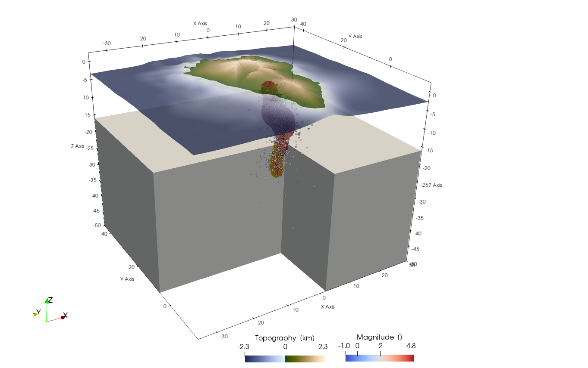

```@meta
EditURL = "../../../tutorials/Tutorial_LaPalma.jl"
```

# Create a Cartesian Model Setup for La Palma

## Aim
In this tutorial, your will learn how to use real data to create a geodynamic model setup in `CartData`.
We will use the data of the Cumbre Viejo eruption in La Palma, which is a volcanic island that erupted from mid september 2021 - december 2021.
The seimsicity from that time-period is used as an inspiration to set the locations of magma intrusions

## 1. Load data
We will use two types of data to create the model
 1) Topography
 2) Earthquake locations

We start with loading the required packages, which includes `GMT` to download topography (an optional dependency for `GeophysicalModelGenerator`)

```julia
using GeophysicalModelGenerator, GMT, DelimitedFiles
```

We will use GMT to download the topography with:

```julia
Topo = ImportTopo(lon = [-18.2, -17.5], lat=[28.4, 29.0], file="@earth_relief_15s.grd")
```

Next, lets load the seismicity. The earthquake data is available on [https://www.ign.es/web/ign/portal/vlc-catalogo](https://www.ign.es/web/ign/portal/vlc-catalogo).
We have filtered them and prepared a file with earthquake locations up to early November 2021 (from january 2021).
Download that:

```julia
#download_data("","EQ_events_all_info5_LaPalma_2021.dat")
data_EQ = readdlm("EQ_events_all_info5_LaPalma_2021.dat")
```

It has the following format:

```julia
lon         =   data_EQ[:,1]
lat         =   data_EQ[:,2]
depth       =  -data_EQ[:,3]
Mag         =   data_EQ[:,10]
```

Create a `GeoData` structure from this:

```julia
data_all_EQ = GeoData(lon,lat,depth, (Magnitude=Mag,))
```

Next, we can write the data to paraview along with the topography. Note that we have to specify that we have `PointData`:

```julia
Write_Paraview(data_all_EQ,"data_all_EQ",PointsData=true)
Write_Paraview(Topo,"Topo")
```


Note that this data is in geographic coordinates, which makes it non-trivial to create slices through the data (see coordinate axis in the plot, where `z` is *not* pointing upwards).

## 2. Convert data to cartesian coordinates
In order to create model setups, it is helpful to first transfer the data to Cartesian.
This requires us to first determine a *projection point*, that is fixed. Often, it is helpful to use the center of the topography for this. In the present example, we will center the model around La Palma itself:

```julia
proj = ProjectionPoint(Lon=-17.84, Lat=28.56)
```

Once this is done you can convert the topographic data to the cartesian reference frame

```julia
EQ_cart   = Convert2CartData(data_all_EQ, proj);
Topo_cart = Convert2CartData(Topo, proj)
```

It is important to realize that the cartesian coordinates of the topographic grid is no longer strictly orthogonal after this conversion. You don't notice that in the current example, as the model domain is rather small.
In other cases, however, this is quite substantial (e.g., India-Asia collision zone).
LaMEM needs an orthogonal grid of topography, which we can create with:

```julia
Topo_model = CartData(XYZGrid(-35:.1:30,-15:.2:45,0));
nothing #hide
```

In a next step, the routine `ProjectCartData` projects a `GeoData` structure to a `CartData` struct

```julia
Topo_model = ProjectCartData(Topo_model, Topo, proj)
```

Let's have a look at the data:

```julia
Write_Paraview(EQ_cart,"EQ_cart",PointsData=true)
Write_Paraview(Topo_model,"Topo_model")
```

## 3. Create a volumetric earthquake plot
It is useful to plot the earthquake density in 3D, which indicates where most action is happening in the system.
For this, we first create a 3D grid of the region:

```julia
Grid_3D = CartData(XYZGrid(-35:.3:30,-15:.25:45,-50:.5:5))
```

Next we check how many earthquakes are around the grid points:

```julia
Grid_3D =PointData2NearestGrid(EQ_cart, Grid_3D, radius_factor=3)
```

And we can define an array with rock types:

```julia
Phases = zeros(Int64,size(Grid_3D.x))
```

Points that are below the surface are set to one:

```julia
Below = belowSurface(Grid_3D, Topo_model);
Phases[Below] .= 1
```

Lets assume that the crust is 15 km thick

```julia
Phases[NumValue(Grid_3D.z) .< -15] .= 2
```

And lets assume that the magma is where we have some earthquake activity:

```julia
ind = findall( (Grid_3D.fields.Count .> 75) .&& Phases.>0)
Phases[ind] .= 3 #Magma
```

Add rocktypes to the grid:

```julia
Grid_3D = AddField(Grid_3D,"Phases",Phases)
```

We can save this to paraview format

```julia
Write_Paraview(Grid_3D,"Grid_3D")
```

The paraview statefile `/tutorials/LaPalma.pvsm` can be used to reproduce the following plot:


---

*This page was generated using [Literate.jl](https://github.com/fredrikekre/Literate.jl).*

