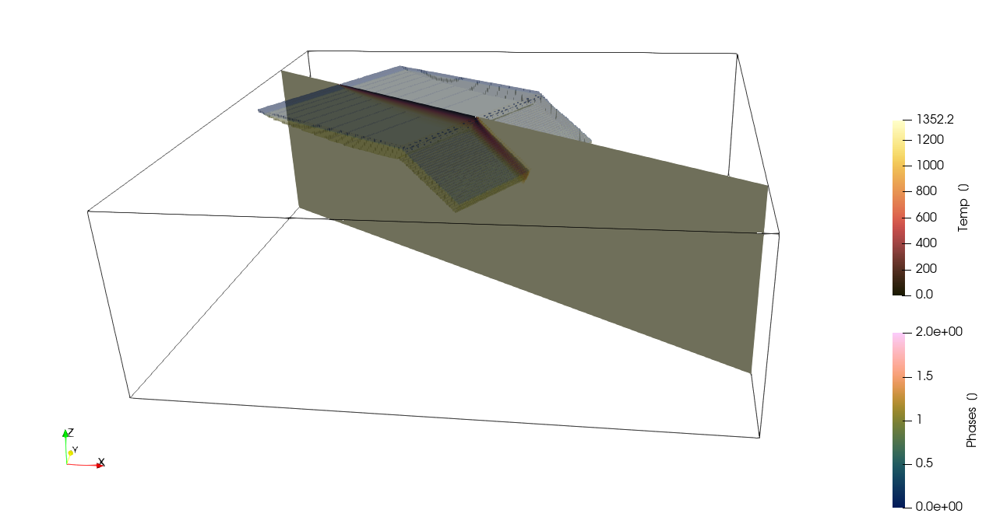

```@meta
EditURL = "../../../tutorials/Tutorial_NumericalModel_3D.jl"
```

# Creating 3D numerical model setups

### Aim
The aim of this tutorial is to show you how to create 3D numerical model setups that can be used as initial setups for other codes.

### 3D Subduction setup

Lets start with creating a 3D model setup in cartesian coordinates, which uses the `CartData` data structure

```julia
using GeophysicalModelGenerator

nx,ny,nz = 512,512,128
x = range(-1000,1000, nx);
y = range(-1000,1000, ny);
z = range(-660,0,    nz);
Grid = CartData(XYZGrid(x,y,z));
```

Now we create an integer array that will hold the `Phases` information (which usually refers to the material or rock type in the simulation)

```julia
Phases = fill(2,nx,ny,nz);
```

In many (geodynamic) models, one also has to define the temperature, so lets define it as well

```julia
Temp = fill(1350.0, nx,ny,nz);
```

#### Simple free subduction setup

Much of the options are explained in the 2D tutorial, which can directly be transferred to 3D.
Therefore, we will start with a simple subduction setup, which consists of a horizontal part that has a mid-oceanic ridge on one explained

We use a lithospheric structure. Note that if the lowermost layer has the same phase as the mantle, you can define `Tlab` as the lithosphere-asthenosphere boundary which will automatically adjust the phase depending on temperature

```julia
lith = LithosphericPhases(Layers=[15 45 10], Phases=[0 1 2], Tlab=1250)
AddBox!(Phases, Temp, Grid; xlim=(-800,0.0), ylim=(-400, 400.0), zlim=(-80.0, 0.0), phase = lith,
        Origin=(-0,0,0),
        T=SpreadingRateTemp(SpreadingVel=3, MORside="right"), StrikeAngle=30);
```

And an an inclined part:

```julia
AddBox!(Phases, Temp, Grid; xlim=(0,300), ylim=(-400, 400.0), zlim=(-80.0, 0.0), phase = lith,
        Origin=(-0,0,0),
        T=McKenzie_subducting_slab(Tsurface=0,v_cm_yr=3), DipAngle=30, StrikeAngle=30);
```

Add them to the `CartData` dataset:

```julia
Grid = addField(Grid,(;Phases, Temp))
```

````
CartData 
    size    : (512, 512, 128)
    x       ϵ [ -1000.0 : 1000.0]
    y       ϵ [ -1000.0 : 1000.0]
    z       ϵ [ -660.0 : 0.0]
    fields  : (:Z, :Phases, :Temp)

````

Which looks like

```julia
Write_Paraview(Grid,"Grid3D_FreeSubduction");
```

````
Saved file: Grid3D_FreeSubduction.vts

````



#### More sophisticated setup

Next, lets consider a somewhat more complicated setup

```julia
Phases = fill(2,nx,ny,nz);
Temp = fill(1350.0, nx,ny,nz);
```

Overriding plate

```julia
lith_cont = LithosphericPhases(Layers=[30 200 10], Phases=[3 4 2], Tlab=1250)
AddBox!(Phases, Temp, Grid; xlim=(200,1000), ylim=(-1000, 0.0), zlim=(-240.0, 0.0), phase = lith_cont, T=HalfspaceCoolingTemp(Age=150));

lith_cont = LithosphericPhases(Layers=[30 200 10], Phases=[5 6 2], Tlab=1250)
AddBox!(Phases, Temp, Grid; xlim=(200,1000), ylim=(0, 1000),    zlim=(-240.0, 0.0), phase = lith_cont, T=HalfspaceCoolingTemp(Age=200));
```

Define a ridge with transform faults

```julia
lith = LithosphericPhases(Layers=[15 45 10], Phases=[0 1 2], Tlab=1250)
AddBox!(Phases, Temp, Grid; xlim=(-800 , 200), ylim=(-1000, -400.0), zlim=(-80.0, 0.0), phase = lith, T=SpreadingRateTemp(SpreadingVel=3));
AddBox!(Phases, Temp, Grid; xlim=(-1000,-800), ylim=(-1000, -400.0), zlim=(-80.0, 0.0), phase = lith, T=SpreadingRateTemp(SpreadingVel=3,MORside="right"));

AddBox!(Phases, Temp, Grid; xlim=(-700,  200), ylim=(-400, 200.0), zlim=(-80.0, 0.0), phase = lith, T=SpreadingRateTemp(SpreadingVel=3));
AddBox!(Phases, Temp, Grid; xlim=(-1000,-700), ylim=(-400, 200.0), zlim=(-80.0, 0.0), phase = lith, T=SpreadingRateTemp(SpreadingVel=3,MORside="right"));

AddBox!(Phases, Temp, Grid; xlim=(-650,  200), ylim=(200, 1000.0), zlim=(-80.0, 0.0), phase = lith, T=SpreadingRateTemp(SpreadingVel=3));
AddBox!(Phases, Temp, Grid; xlim=(-1000,-650), ylim=(200, 1000.0), zlim=(-80.0, 0.0), phase = lith, T=SpreadingRateTemp(SpreadingVel=3,MORside="right"));
```

Inclined part of slab

```julia
lith = LithosphericPhases(Layers=[15 15 45 40], Phases=[7 0 1 2], Tlab=1250)

AddBox!(Phases, Temp, Grid; xlim=(200,700), ylim=(-1000, 0.0), zlim=(-200.0, 15), phase = lith,  T=ConstantTemp(T=1350), DipAngle=30);
AddBox!(Phases, Temp, Grid; xlim=(200,700), ylim=(0, 100.0), zlim=(-200.0, 15), phase = lith,  T=ConstantTemp(T=1350), DipAngle=35);

AddBox!(Phases, Temp, Grid; xlim=(200,700), ylim=(-1000, 0.0), zlim=(-110.0, 15), phase = lith,  T=McKenzie_subducting_slab(Tsurface=0,v_cm_yr=3), DipAngle=30);
AddBox!(Phases, Temp, Grid; xlim=(200,700), ylim=(0, 1000), zlim=(-110.0, 15), phase = lith,  T=McKenzie_subducting_slab(Tsurface=0,v_cm_yr=3), DipAngle=35);

replace!(Temp, NaN => 0.0);

Add them to the `CartData` dataset:

```julia
Grid = addField(Grid,(;Phases, Temp))
Write_Paraview(Grid,"Grid3D_Ridges");
```

````
Saved file: Grid3D_Ridges.vts

````


---

*This page was generated using [Literate.jl](https://github.com/fredrikekre/Literate.jl).*

