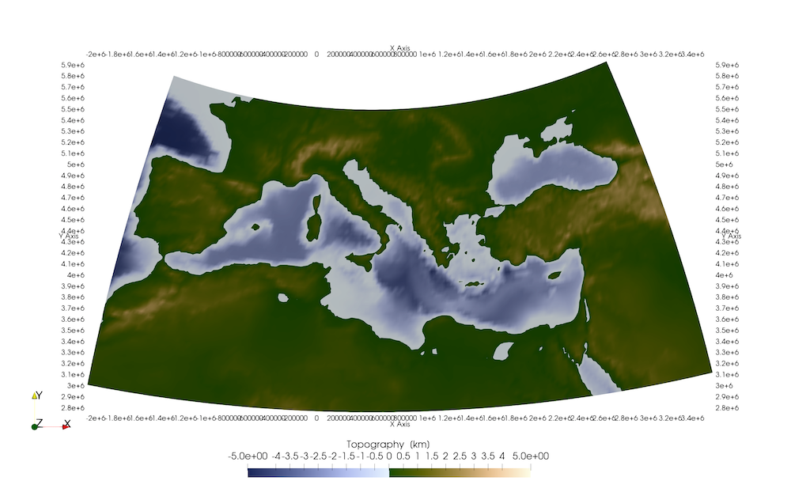
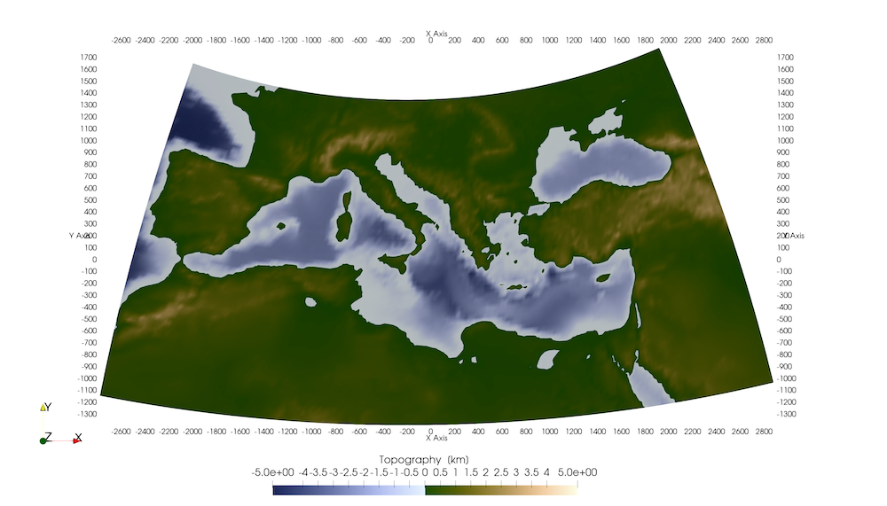

# Projecting & converting data

Typically, you load a dataset by reading it into julia and either generating a `GeoData` structure (in case you have `longitude/latitude/depth` info), or as `UTMData` (in case the data is in `UTM coordinates`, which requires you to specify the zone & hemisphere).

If you write the data to `Paraview`, it is internally converted to a Paraview structure (which involves `x,y,z` Cartesian Earth-Centered-Earth-Fixed (ECEF) coordinates using the `wgs84` ellipsoid). 

Yet, if you do geodynamic calculations the chances are that the geodynamic code does not operate in spherical coordinates, but rather use cartesian ones. In that case you should transfer your data to the `CartData` structure, which requires you to specify a `ProjectionPoint` that is a point on the map that will later have the coordinates `(0,0)` in the `CartData` structure.


#### 1. Converting
Converting from one coordinate system to the other is straightforward. Let's use Europe as an example:

```julia
julia> using GeophysicalModelGenerator, GMT
julia> Topo = ImportTopo(lon = [-10, 45], lat=[25, 50], file="@earth_relief_20m")
GeoData 
  size  : (165, 75, 1)
  lon   ϵ [ -10.0 : 44.666666666666664]
  lat   ϵ [ 25.0 : 49.666666666666664]
  depth ϵ [ -4.9855 km : 3.123 km]
  fields: (:Topography,)
julia> Write_Paraview(Topo,"Topo")
Saved file: Topo.vts
```
The result is shown on the globe as: 


You can convert this to UTM zone as:
```julia
julia> convert(UTMData, Topo)
UTMData 
  UTM zone : 29-38 North
    size   : (165, 75, 1)
    EW     ϵ [ 197181.31221507967 : 769155.4572884373]
    NS     ϵ [ 2.7649477474783654e6 : 5.505892073781423e6]
    depth  ϵ [ -4985.5 m : 3123.0 m]
    fields : (:Topography,)
```
As the area is large, it covers a range of `UTM` zones (and every point has a UTM zone attached). Within each zone, the coordinates are approximately orthogonal. Plotting this to Paraview does *not* result in a sensible dataset.

Yet, what we could do instead is show all data with respect to a single UTM zone. For this, we have to select a point around which we project (in this case more or less in the center):

```julia
julia> p=ProjectionPoint(Lon=17.3, Lat=37.5)
ProjectionPoint(37.5, 17.3, 703311.4380385976, 4.152826288024972e6, 33, true)
```

Projecting the `GeoData` set using this projection point is done with:
```julia
julia> Convert2UTMzone(Topo,p)
UTMData 
  UTM zone : 33-33 North
    size   : (165, 75, 1)
    EW     ϵ [ -2.0750691599137965e6 : 3.581351293385453e6]
    NS     ϵ [ 2.7649477474783654e6 : 5.938114212160672e6]
    depth  ϵ [ -4985.5 m : 3123.0 m]
    fields : (:Topography,)
```
Whereas this is now in UTM Data (in meters), it is distorted. 


Often it is more convenient to have this in `CartData`, which is done in a similar manner:
```julia
julia> Topo_Cart = Convert2CartData(Topo,p)
CartData 
    size   : (165, 75, 1)
    x      ϵ [ -2778.3805979523936 km : 2878.039855346856 km]
    y      ϵ [ -1387.8785405466067 km : 1785.2879241356998 km]
    z      ϵ [ -4.9855 km : 3.123 km]
    fields : (:Topography,)
```
This shows that the model is ~5600 by 3000 km.


Whereas this is ok to look at and compare with a LaMEM model setup, we cannot use it to perform internal calculations (or to generate a LaMEM model setup), because the `x` and `y` coordinates are distorted and not orthogonal. 

#### 2. Projecting data
For use with LaMEM, you would need an orthogonal cartesian grid. From the last command above we get some idea on the area, so we can create this:
```julia
julia> Topo_Cart_orth  = CartData(XYZGrid(-2000:20:2000,-1000:20:1000,0))
CartData 
    size   : (201, 101, 1)
    x      ϵ [ -2000.0 km : 2000.0 km]
    y      ϵ [ -1000.0 km : 1000.0 km]
    z      ϵ [ 0.0 km : 0.0 km]
    fields : (:Z,)
```
Next, we can project the topographic data (in `GeoData` format) on this orthogonal grid
```julia
julia> Topo_Cart_orth  = ProjectCartData(Topo_Cart_orth, Topo, p)
CartData 
    size   : (201, 101, 1)
    x      ϵ [ -2000.0 km : 2000.0 km]
    y      ϵ [ -1000.0 km : 1000.0 km]
    z      ϵ [ -4.485650671162607 km : 2.5909655318121865 km]
    fields : (:Topography,)
julia> Write_Paraview(Topo_Cart_orth,"Topo_Cart_orth");    
```

So this interpolates the topographic data from the `GeoData` to the orthogonal cartesian grid (which can be used with LaMEM, for example).

You can do similar projections with full 3D data sets or pointwise data. 

#### 3. List of relevant functions

```@docs
GeophysicalModelGenerator.Convert2CartData
GeophysicalModelGenerator.ProjectCartData
GeophysicalModelGenerator.Convert2UTMzone
```
