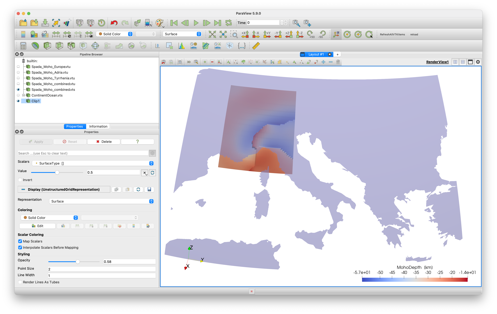

# Add coastlines 

## Goal

For orientation, it is often nice to add country borders and coastlines to your paraview plots. 

## Steps

#### 1. Coast lines
##### 1.1 Download land/sea data
The package `GeoDatasets.jl` has a simple interface to get a grid that explains whether the Earth surface is land, sea or a lake.

```julia
julia> using GeoDatasets
julia> lon,lat,data = GeoDatasets.landseamask(;resolution='l',grid=1.25);
julia> ind_lon = findall( (lon .> 0) .& (lon .< 30 ) );
julia> ind_lat = findall( (lat .> 35) .& (lat .< 50 ) );
```
The parameter resolution should be either `c`,`l`,`i`,`h` or `f` (standing for crude, low, intermediate, high and full resolution)

##### 1.2 Save in Paraview
```julia
julia> Lon,Lat,Depth    =   lonlatdepth_grid(lon[ind_lon],lat[ind_lat],0km);
julia> data_surf        =   zeros(size(Lon));
julia> data_surf[:,:,1] =   data[ind_lon,ind_lat]
julia> data_surface     =   GeoData(Lon, Lat, Depth, (SurfaceType=data_surf,))
julia> write_Paraview(data_surface, "ContinentOcean") 
```
The result is shown here, together with Moho data

