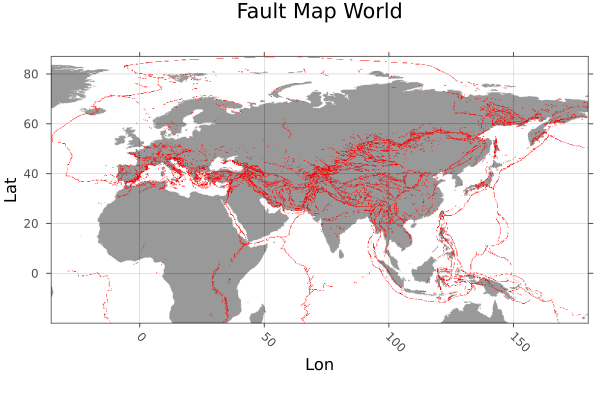
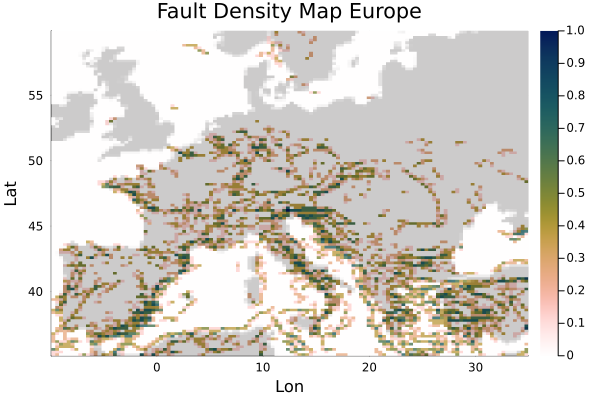

# Fault Density Map

## Aim
In this tutorial Fault Data is loaded as Shapefiles, which is then transformed to raster data. With the help of that a fault density map of Europe is created with the CountMap function

## Load Data

Load packages
````julia
using GeophysicalModelGenerator, Shapefile, Plots, Rasters, GeoDatasets, Interpolations
````

Data from "Active Faults of Eurasia Database AFEAD v2022" DOI:10.13140/RG.2.2.25509.58084

````julia
File   = "AFEAD_v2022/AFEAD_v2022/AFEAD_v2022.shp"
````

Load data using Shapefile

````julia
table  = Shapefile.Table(File)
geoms  = Shapefile.shapes(table)
CONF   = table.CONF
````

Raster the shapefile data

````julia
ind     = findall((table.CONF .== "A") .| (table.CONF .== "B") .| (table.CONF .== "C"))
faults  = Shapefile.Handle(File).shapes[ind]
faults  = rasterize(last,faults; res=(0.12,0.12), missingval=0, fill=1, atol = 0.4, shape=:line)
lon    = faults.dims[1]
lat    = faults.dims[2]
````

download coastlines with GeoDatasets

````julia
lonC,latC,dataC = GeoDatasets.landseamask(;resolution='l',grid=10);
````

interpolate to fault grid

````julia
itp        = linear_interpolation((lonC, latC), dataC)
coastlines = itp[lon.val,lat.val]
coastlines = map(y -> y > 1 ? 1 : y, coastlines)
````

plot the fault data

````julia
heatmap(lon.val,lat.val,coastlines',legend=false,colormap=cgrad(:gray1,rev=true),alpha=0.4);
plot!(faults; color=:red,legend = false,title="Fault Map World",ylabel="Lat",xlabel="Lon")
````


restrict area to Europe

````julia
indlat = findall((lat .> 35) .& (lat .< 60))
Lat    = lat[indlat]
indlon = findall((lon .> -10) .& (lon .< 35))
Lon    = lon[indlon]
data   = faults.data[indlon,indlat]
````

Create GeoData from restricted data

````julia
Lon3D,Lat3D, Faults = LonLatDepthGrid(Lon,Lat,0);
Faults[:,:,1]       = data
Data_Faults         = GeoData(Lon3D,Lat3D,Faults,(Faults=Faults,))
````
#### Create Density Map 
Create a density map of the faults data. This is done with the CountMap function. This function takes a 2D GeoData struct 

````julia
steplon  = 125
steplat  = 70
countmap = CountMap(Data_Faults,"Faults",steplon,steplat)
````

Plot the density map with coastlines

````julia
lon = unique(countmap.lon.val)
lat = unique(countmap.lat.val)
coastlinesEurope = itp[lon,lat]
coastlinesEurope = map(y -> y > 1 ? 1 : y, coastlinesEurope)
heatmap(lon,lat,coastlinesEurope',colormap=cgrad(:gray1,rev=true),alpha=1.0);
heatmap!(lon,lat,countmap.fields.CountMap[:,:,1]',colormap=cgrad(:batlowW,rev=true),alpha = 0.8,legend=true,title="Fault Density Map Europe",ylabel="Lat",xlabel="Lon")
````


---

*This page was generated using [Literate.jl](https://github.com/fredrikekre/Literate.jl).*

