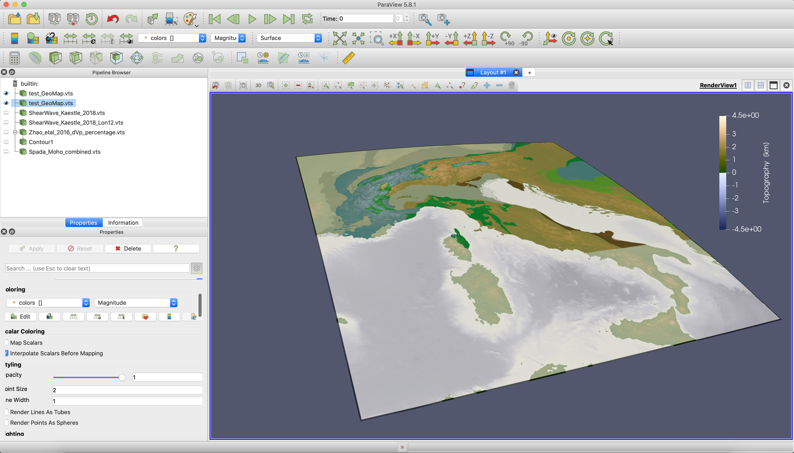

# Extract topographic data and drape a geological map on top of it (given as raster graphics)

## Goal

In many cases, we want to add topographic data as well a information about tectonic units to our visualization. This tutorial shows how to use [GMT.jl](https://github.com/GenericMappingTools/GMT.jl) to import data from an ETOPO1 file for a certain region, load a geological map from a raster graphics file (here: PNG), drape it over the topography and transfer that.

## Steps

#### 1. Download topographic data and tectonic maps of the Alpine region
The ETOPO1 data file used in this example can be downloaded here:  
[https://ngdc.noaa.gov/mgg/global/global.html](https://ngdc.noaa.gov/mgg/global/global.html). For this example, we downloaded `ETOPO1_Ice_g_gmt4.grd` and stored it directly in the folder where we will be working. For the geological map, we download the data from the [SPP 4DMB repository](http://www.spp-mountainbuilding.de/data/Maps.zip) and extract the zip file (to the current folder). In this data set, a `gmt` file with the data for different tectonic units is given in `./tectonic_maps_4dmb_2020_09_17/GMT_example/alcapadi_polygons.gmt`. 

#### 2. Create a tectonic map with orthogonal projection 
To create a png with an orthogonal map projection (which we need for the png import), we do the following in julia:  
```julia
julia> using GMT
julia> filename_gmt = "./tectonic_maps_4dmb_2020_09_17/GMT_example/alcapadi_polygons.gmt"
julia> plot(filename_gmt,region="4/20/37/49",show=true)
```
This opens a window with the plotted map. Save this image in your current working folder. Open it with a image manipulation of your choice (e.g. GIMP) and crop it to the map itself. Save the cropped image in your current working directory. For this tutorial, we have named the cropped png file `tectonicmap_SPP.png`. It looks like this:


#### 3. Import data to paraview  
Now, to import the ETOPO1 topography data and to drape the geologic map over it, open julia again. Load the following packages:
```julia
julia> using GMT, NearestNeighbors, GeoParams, GeophysicalModelGenerator
```
First, define the filenames of the files you want to import:  
```julia
julia> filename_topo = "./ETOPO1/ETOPO1_Ice_g_gmt4.grd" 
julia> filename_geo  = "./tectonicmap_SPP.png"
```
Next, define the region that you want to visualize (note that we use the same coordinates here as we used previously for the generation of the geological map):  
```julia
julia> lat_min = 37.0
julia> lat_max = 49.0
julia> lon_min = 4.0
julia> lon_max = 20.0
```
and import the data
```julia
julia> G = gmtread(filename_topo, limits=[lon_min,lon_max,lat_min,lat_max], grid=true);
julia> Lon,Lat,Depth = LonLatDepthGrid(G.x[1:end],G.y[1:end],0);
julia> numel_topo    = prod(size(Lon));
julia> Depth[:,:,1]  = 1e-3*G.z';
julia> Topo          = GeophysicalModelGenerator.GeoData(Lon, Lat, Depth, (Topography=Depth*km,))
```
At this step, only the topographic data is imported. Now we have to import the tectonic map from the png file. To do so, first define the longitude and latitude of the lower left and upper right corner of the png:
```julia
julia> Corner_LowerLeft  = (lon_min, lat_min , 0.0)
julia> Corner_UpperRight = (lon_max, lat_max , 0.0)
```
and import the png file with the GMG function `Screenshot_To_GeoData`:  

```julia
julia> DataPNG = Screenshot_To_GeoData(filename_geo, Corner_LowerLeft, Corner_UpperRight)
```

Next, we drape the screenshot on the topographic map with `drape_on_topo`:
```julia
julia> TopoGeology = drape_on_topo(Topo, DataPNG)
```

#### 4. Save

Transforming the to Paraview is now a piece of cake:

```julia
julia> Write_Paraview(TopoGeology, "test_GeoMap")
```
The result is shown here:



In case you are interested: we are employing the `oleron` scientific colormap from [Fabio Crameri's scientific colormap package](https://www.fabiocrameri.ch/colourmaps/) here.