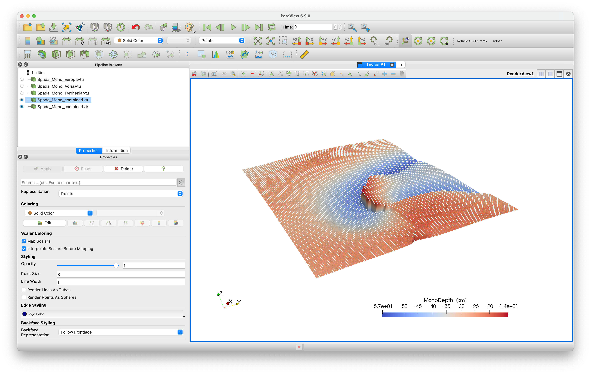

# Moho topography

## Goal
This explains how to load the Moho topography for Italy and the Alps and create a paraview file

Spada, M., Bianchi, I., Kissling, E., Agostinetti, N.P., Wiemer, S., 2013. *Combining controlled-source seismology and receiver function information to derive 3-D Moho topography for Italy.* Geophysical Journal International 194, 1050–1068. [doi:10.1093/gji/ggt148](https://doi.org/10.1093/gji/ggt148)


## Steps
#### 1. Download data
The data is available as digital dataset on the researchgate page of Prof. Edi Kissling
[https://www.researchgate.net/publication/322682919_Moho_Map_Data-WesternAlps-SpadaETAL2013](https://www.researchgate.net/publication/322682919_Moho_Map_Data-WesternAlps-SpadaETAL2013)

We have also uploaded it here:
[https://seafile.rlp.net/d/a50881f45aa34cdeb3c0/](https://seafile.rlp.net/d/a50881f45aa34cdeb3c0/)

The full data set actually includes 3 different Moho's (Europe, Adria, Tyrrhenia-Corsica). To simplify matters, we have split the full file into 3 separate ascii files and uploaded it.

Please download the files `Moho_Map_Data-WesternAlps-SpadaETAL2013_Moho1.txt`, `Moho_Map_Data-WesternAlps-SpadaETAL2013_Moho2.txt` and `Moho_Map_Data-WesternAlps-SpadaETAL2013_Moho3.txt`


#### 2. Read data into Julia
The data sets start at line 39. We read this into julia as:
```julia
julia> using DelimitedFiles
julia> data =readdlm("Moho_Map_Data-WesternAlps-SpadaETAL2013_Moho1.txt",' ',Float64,'\n', skipstart=38,header=false)
julia> lon, lat, depth        = data[:,1], data[:,2], -data[:,3];
```
Note that depth is made negative.

#### 3. Reformat the data

Next, let's check if the data is spaced in a regular manner in Lon/Lat direction.
For that, we plot it using the `Plots` package (you may have to install that first on your machine).
```julia
julia> using Plots
julia> scatter(lon,lat,marker_z=depth, ylabel="latitude",xlabel="longitude",markersize=2.5, c = :roma)
```


What we can see nicely here is that the data is reasonably regular but also that there are obviously locations where no data is define.

The easiest way to transfer this to Paraview is to simply save this as 3D data points:

```julia
julia> using GeophysicalModelGenerator
julia> data_Moho1 = GeoData(lon,lat,depth,(MohoDepth=depth*km,))
GeoData
  size  : (12355,)
  lon   ϵ [ 4.00026 - 11.99991]
  lat   ϵ [ 42.51778 - 48.99544]
  depth ϵ [ -57.46 km - -21.34 km]
  fields: (:MohoDepth,)
julia>  Write_Paraview(data_Moho1, "Spada_Moho_Europe", PointsData=true)
```
And we can do the same with the other two Moho's:

```julia
julia> data =readdlm("Moho_Map_Data-WesternAlps-SpadaETAL2013_Moho2.txt",' ',Float64,'\n', skipstart=38,header=false);
julia> lon, lat, depth        = data[:,1], data[:,2], -data[:,3];
julia> data_Moho2 = GeoData(lon,lat,depth,(MohoDepth=depth*km,))
julia> Write_Paraview(data_Moho2, "Spada_Moho_Adria", PointsData=true)
julia> data =readdlm("Moho_Map_Data-WesternAlps-SpadaETAL2013_Moho3.txt",' ',Float64,'\n', skipstart=38,header=false);
julia> lon, lat, depth        = data[:,1], data[:,2], -data[:,3];
julia> data_Moho3 = GeoData(lon,lat,depth,(MohoDepth=depth*km,))
julia> Write_Paraview(data_Moho3, "Spada_Moho_Tyrrhenia", PointsData=true)
```

If we plot this in paraview, it looks like this:


#### 3.1 Fitting a mesh through the data
So obviously, the Moho is discontinuous between these three Mohos. Often, it looks nicer if we fit a regular surface through these data points. To do this we first combine the data points of the 3 surfaces into one set of points

```
julia> lon   = [data_Moho1.lon.val;   data_Moho2.lon.val;   data_Moho3.lon.val];
julia> lat   = [data_Moho1.lat.val;   data_Moho2.lat.val;   data_Moho3.lat.val];
julia> depth = [data_Moho1.depth.val; data_Moho2.depth.val; data_Moho3.depth.val];
julia> data_Moho_combined = GeoData(lon, lat, depth, (MohoDepth=depth*km,))
```

Next, we define a regular lon/lat grid
```julia
julia> Lon,Lat,Depth     =   LonLatDepthGrid(4.1:0.1:11.9,42.5:.1:49,-30km);
```

And we will use a nearest neighbor interpolation method to fit a surface through the data. This has the advantage that it will take the discontinuities into account. We will use the package [NearestNeighbors.jl](https://github.com/KristofferC/NearestNeighbors.jl) for this, which you may have to install first
```julia
julia> using NearestNeighbors
julia> kdtree = KDTree([lon'; lat'])
julia> idxs, dists = knn(kdtree, [Lon[:]'; Lat[:]'], 1, true)
```
`idxs` contains the indices of the closest points to the grid in (Lon,Lat). Next
```julia
julia> Depth = zeros(size(Lon))*km;
julia> for i=1:length(idxs)
          Depth[i] = depth[idxs[i]][1]
       end
```
Now, we can create a `GeoData` structure with the regular surface and save it to paraview:

```julia
julia> data_Moho = GeoData(Lon, Lat, Depth, (MohoDepth=Depth,))
julia> Write_Paraview(data_Moho, "Spada_Moho_combined")
```
The result is shown here, where the previous points are colored white and are a bit smaller. Obviously, the datasets coincide well.


#### 4. Julia script

The full julia script that does it all is given [here](https://github.com/JuliaGeodynamics/GeophysicalModelGenerator.jl/blob/main/tutorials/MohoTopo_Spada.jl). You need to be in the same directory as in the data file, after which you can run it in julia with
```julia
julia> include("MohoTopo_Spada.jl")
```
