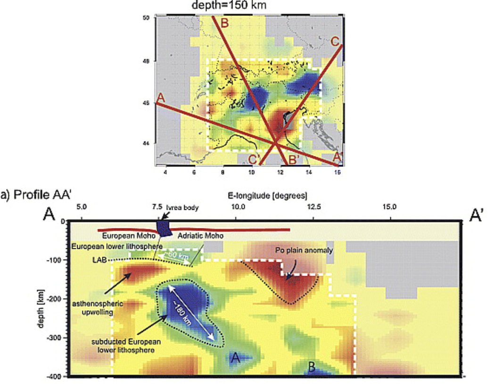

# Import profiles/maps from published papers

## Goal
Ideally, all data should be available in digital format, after which you could use the tools described in the other tutorial to transform them into `GeoData` and export them to VTK.
Yet, the reality is different and often data is not (yet) available, or papers are old and the authors can no longer be contacted.

For that reason, `GeophysicalModelGenerator` has tools that allow you to transfer a screenshot from any published paper into `GeoData/Paraview` and see it in 3D at the correct geographic location. This can be done for vertical profiles and for mapviews, which gives you a quick and easy way to see those papers in a new (3D) light.

Here, we explain how.
- [Import profiles/maps from published papers](#import-profilesmaps-from-published-papers)
  - [Goal](#goal)
  - [General procedure](#general-procedure)
      - [1. Download data and crop images](#1-download-data-and-crop-images)
      - [2. Read data of a cross-section \& create VTS file](#2-read-data-of-a-cross-section--create-vts-file)
      - [3. Read data of a mapview \& create \*.vts file](#3-read-data-of-a-mapview--create-vts-file)
      - [4. Using an automatic digitizer to pick points on map](#4-using-an-automatic-digitizer-to-pick-points-on-map)
      - [5. Creating a multiblock Paraview/\*.vtm file](#5-creating-a-multiblock-paraviewvtm-file)
      - [6. Julia script](#6-julia-script)
## General procedure
#### 1. Download data and crop images
For this example, we use a well-known paper about the Alps which is now openly available:

Lippitsch, R., 2003. Upper mantle structure beneath the Alpine orogen from high-resolution teleseismic tomography. J. Geophys. Res. 108, 2376. [https://doi.org/10.1029/2002JB002016](https://doi.org/10.1029/2002JB002016)


Figure 12 contains a number of horizontal slices @ different depth, whereas Figure 13 contains 3 vertical profiles and a mapview that illustrates where the profile was taken. The first profile is shown here:



The first step is to crop the image such that we only see the profile itself:


#### 2. Read data of a cross-section & create VTS file

We look at the bigger image and determine the `lon,lat,depth` coordinates of the lower left and upper right corners of this image. We estimate this to be (well, in fact, Mark Handy knew the exact coordinates, which contain a typo in the paper but are correct in her PhD thesis):
```julia
julia> Corner_LowerLeft  = ( 4.65, 45.73, -400.0)
julia> Corner_UpperRight = (17.23, 43.80, 0.0)
```

Once this is done, and we saved the picture under `Lippitsch_Fig13a.png`, you can transfer it into GeoData format with:

```julia
julia> using GeophysicalModelGenerator
julia> data_profile1 = Screenshot_To_GeoData("Lippitsch_Fig13a.png",Corner_LowerLeft, Corner_UpperRight)
Extracting GeoData from: Lippitsch_Fig13a.png
           └ Corners:         lon       lat       depth
              └ lower left  = (4.65   , 45.73  ,  -400.0 )
              └ lower right = (17.23  , 43.8   ,  -400.0 )
              └ upper left  = (4.65   , 45.73  ,  0.0    )
              └ upper right = (17.23  , 43.8   ,  0.0    )
GeoData
  size  : (325, 824, 1)
  lon   ϵ [ 4.6499999999999995 : 17.230000000000004]
  lat   ϵ [ 43.79999999999999 : 45.730000000000004]
  depth ϵ [ -400.00000000000006 km : 0.0 km]
  fields: (:colors,)
```
Finally, you save it in Paraview format as always:
```julia
julia> Write_Paraview(data_profile1, "Lippitsch_Fig13a_profile")
```

You can open this in paraview. Here, it is shown along with topographic data (made transparent):


Note that if you want to see the image with the original colors, you should *unselect* the `Map Scalars` option in the `Properties` tab (red ellipse).


#### 3. Read data of a mapview & create *.vts file

Creating a map follows the same procedure. The only difference is that maps are sometimes distorted which means that the axis are not necessarily orthogonal in `lon/lat` space. In that case, you need to specify all 4 corners. Internally, we linearly interpolate between those values.

An example is given here, which uses the mapview of Fig. 13 of the same paper (@ 150 km depth):


```julia
Corner_LowerLeft    =   ( 3.5, 43.0 , -150.0)
Corner_UpperRight   =   (15.5, 50.0 , -150.0)
Corner_LowerRight   =   (15.5, 43.0 , -150.0)
Corner_UpperLeft    =   (3.5 , 50.0 , -150.0)
data_Fig13_map      =   Screenshot_To_GeoData("Fig13_mapview.png",Corner_LowerLeft, Corner_UpperRight, Corner_LowerRight=Corner_LowerRight,Corner_UpperLeft=Corner_UpperLeft)
Write_Paraview(data_Fig13_map, "Lippitsch_Fig13_mapview")
```

Once added to paraview (together with a few additional map views from the same paper):


#### 4. Using an automatic digitizer to pick points on map
Often, it is not straightforward to determine the begin/end points of a profile and have to guess that by looking at the mapview (which is inprecise). To help with that, you can digitize the map and use an automatic digitizer to pick points on the map.

A great online tool to do exactly that can be found here:
[https://automeris.io/WebPlotDigitizer/](https://automeris.io/WebPlotDigitizer/)

For this, you need to create a screenshot that is slightly larger and includes the axis (or a scale bar).
As an example, you can use the image `Digitizer_1.png` which you can download here [https://github.com/JuliaGeodynamics/GeophysicalModelGenerator.jl/blob/main/docs/src/assets/img/Digitizer_1.png](https://github.com/JuliaGeodynamics/GeophysicalModelGenerator.jl/blob/main/docs/src/assets/img/Digitizer_1.png).

If import this in the online tool and indicate this to be a `2D (X-Y) Plot`, it will ask us to pick 2 points on the `X` axis and 2 points on the `Y` axis:


Once the map is referenced accordingly, we can pick points (here for `C' - C`) and show the corresponding data values:


Which can again be used to set your profile.

#### 5. Creating a multiblock Paraview/*.vtm file

If you are importing a lot of cross-sections at the same time in Paraview, you end up having a lot of open profiles.
For that reason it is possible to save a "multi-block" *.vtm file, which combines several files into one.
The general approach is simple: open a multiblock file, and pass the filename to `Write_Paraview`. Once you are done, save it.
An example showing you how this works is:
```julia
julia> vtmfile = vtk_multiblock("Lippitsch_CrossSections")
julia> Write_Paraview(data_Fig12_90km, vtmfile)
julia> Write_Paraview(data_Fig12_180km, vtmfile)
julia> Write_Paraview(data_Fig12_300km, vtmfile)
julia> Write_Paraview(data_Fig12_400km, vtmfile)
julia> vtk_save(vtmfile)
```
Note that you have to create the cross-sections first (see the julia script below).

#### 6. Julia script
For convenience we collected a few screenshots and uploaded it from [https://seafile.rlp.net/d/a50881f45aa34cdeb3c0/](https://seafile.rlp.net/d/a50881f45aa34cdeb3c0/).

The full julia script that interprets all the figures is given [here](https://github.com/JuliaGeodynamics/GeophysicalModelGenerator.jl/tree/main/tutorial/Lippitsch_Screenshots.jl).
```julia
julia> include("Lippitsch_Screenshots.jl")
```
