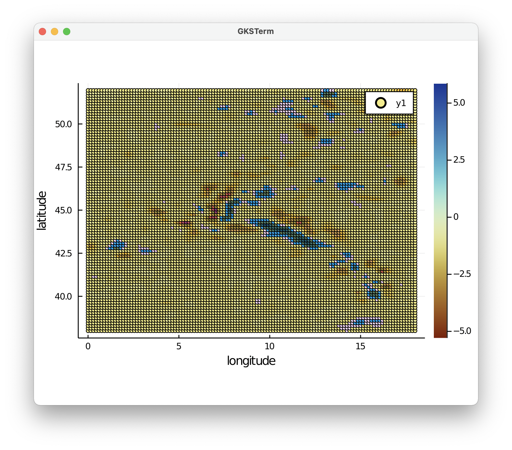
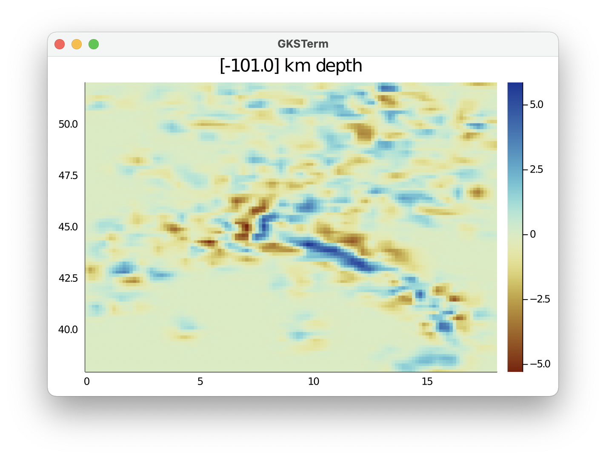
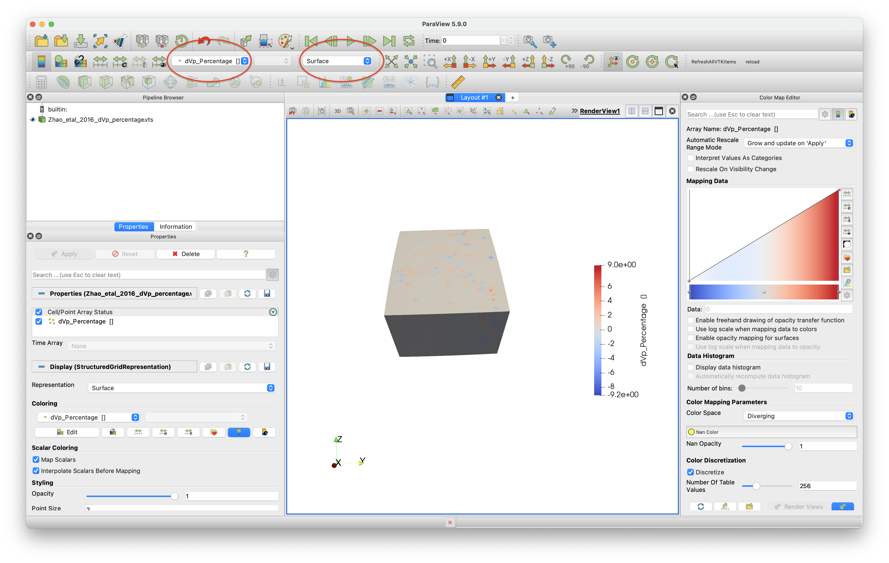
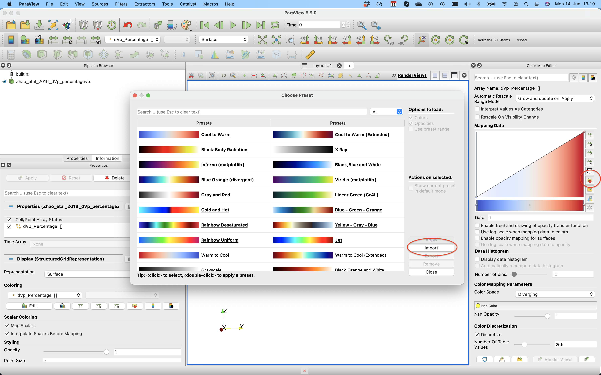
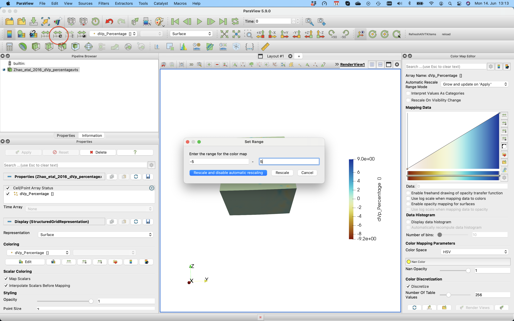
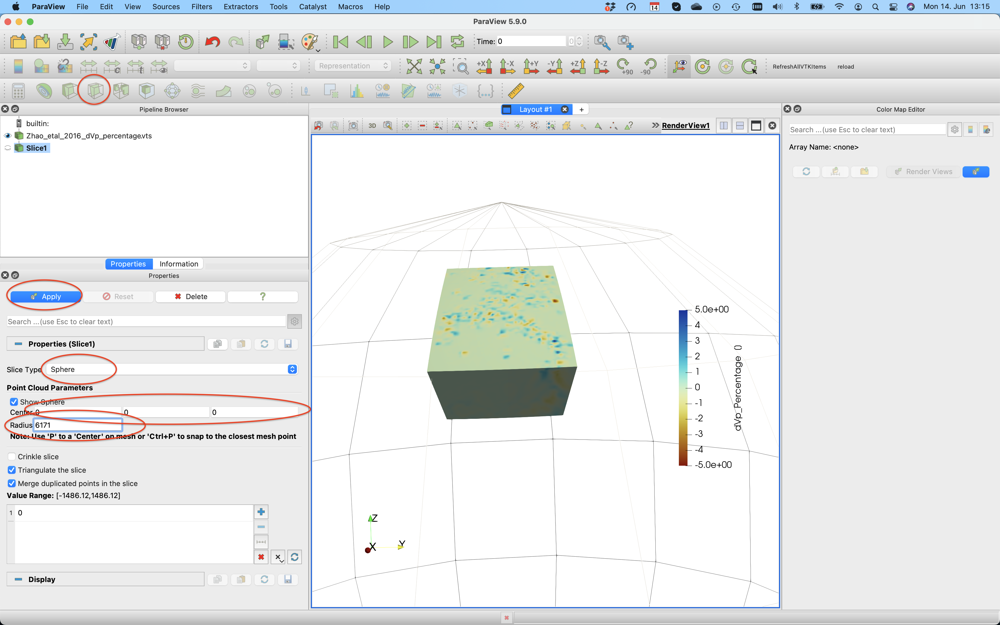
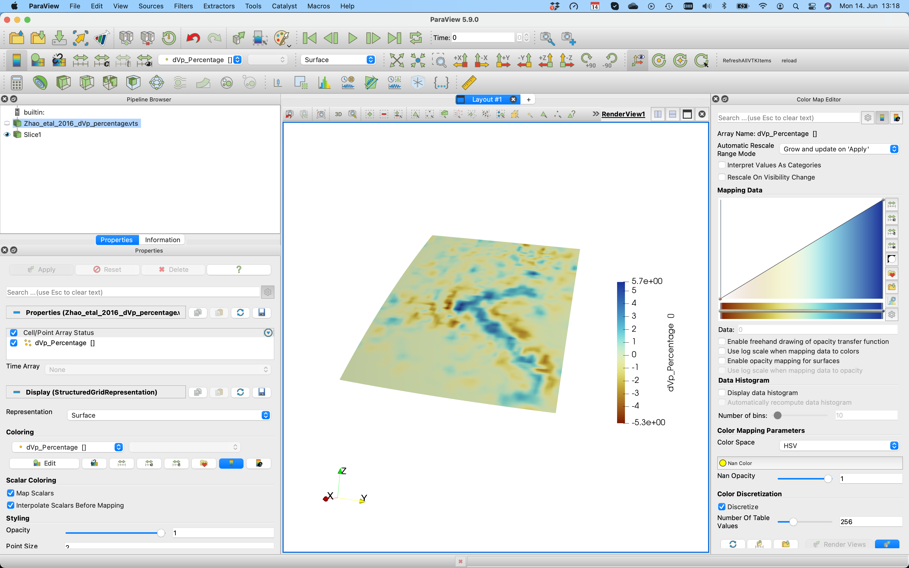
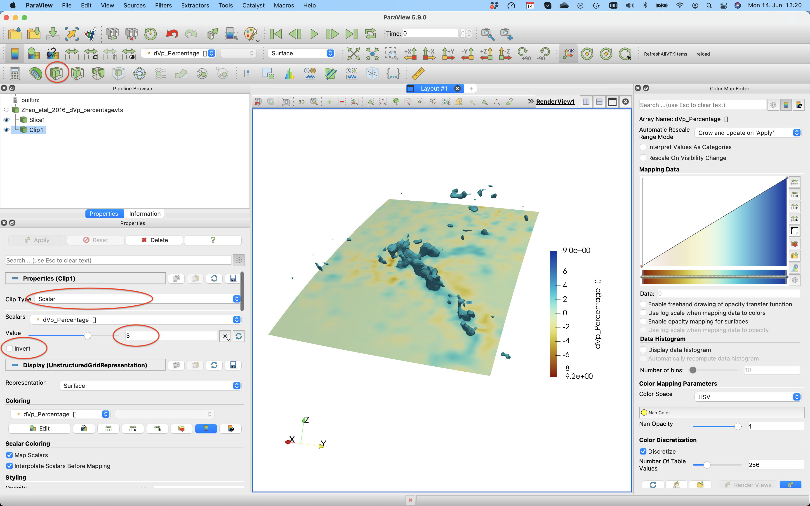

# 3D tomography model in CSV formation

## Goal
This explains how to load a 3D P-wave model and plot it in Paraview as a 3D volumetric data set. It also shows how you can create horizontal or vertical cross-sections through the data in a straightforward manner and how you can extract subsets of the data;
The example is the P-wave velocity model of the Alps as described in: 

Zhao, L., Paul, A., Malusà, M.G., Xu, X., Zheng, T., Solarino, S., Guillot, S., Schwartz, S., Dumont, T., Salimbeni, S., Aubert, C., Pondrelli, S., Wang, Q., Zhu, R., 2016. *Continuity of the Alpine slab unraveled by high-resolution P wave tomography*. Journal of Geophysical Research: Solid Earth 121, 8720–8737. [doi:10.1002/2016JB013310](https://doi.org/10.1002/2016JB013310)

The data is given in ASCII format with longitude/latitude/depth/velocity anomaly (percentage) format.

## Steps
#### 1. Download data 
The data is can be downloaded from [https://seafile.rlp.net/d/a50881f45aa34cdeb3c0/](https://seafile.rlp.net/d/a50881f45aa34cdeb3c0/), where you should download the file `Zhao_etal_JGR_2016_Pwave_Alps_3D_k60.txt`. Do that and start julia from the directory where it was downloaded.
#### 2. Read data into Julia
The dataset has no comments, and the data values in every row are separated by a space. In order to read this into julia as a matrix, we can use the build-in julia package `DelimitedFiles`.    We want the resulting data to be stored as double precision values (`Float64`), and the end of every line is a linebreak (`\n`).
```julia
julia> using DelimitedFiles
julia> data=readdlm("Zhao_etal_JGR_2016_Pwave_Alps_3D_k60.txt",' ',Float64,'\n', skipstart=0,header=false)
1148774×4 Matrix{Float64}:
  0.0   38.0   -1001.0  -0.113
  0.15  38.0   -1001.0  -0.081
  0.3   38.0   -1001.0  -0.069
  0.45  38.0   -1001.0  -0.059
  0.6   38.0   -1001.0  -0.055
  0.75  38.0   -1001.0  -0.057
  ⋮                     
 17.25  51.95     -1.0  -0.01
 17.4   51.95     -1.0  -0.005
 17.55  51.95     -1.0   0.003
 17.7   51.95     -1.0   0.007
 17.85  51.95     -1.0   0.006
 18.0   51.95     -1.0   0.003
```
Next, extract vectors from it:
```julia
julia> lon        = data[:,1];
julia> lat        = data[:,2];
julia> depth      = data[:,3];
julia> dVp_perc   = data[:,4];
```
Note that depth needs to with negative numbers.

#### 3. Reformat the data

Let's first have a look at the depth range of the data set:
```julia
julia> Depth_vec = unique(depth)
101-element Vector{Float64}:
 -1001.0
  -991.0
  -981.0
  -971.0
  -961.0
  -951.0
     ⋮
   -51.0
   -41.0
   -31.0
   -21.0
   -11.0
    -1.0
```
So the data has a vertical spacing of 10 km.
Next, let's check if the data is spaced in a regular manner in Lon/Lat direction. 
For that, we read the data at a given depth level (say -101km) and plot it using the `Plots` package (you may have to install that first on your machine).
```julia
julia> using Plots
julia> ind=findall(x -> x==-101.0, depth)
julia> scatter(lon[ind],lat[ind],marker_z=dVp_perc[ind], ylabel="latitude",xlabel="longitude",markersize=2.5, c = :roma)
```


Note that we employ the scientific colormap `roma` here. [This](https://docs.juliaplots.org/latest/generated/colorschemes/) gives an overview of available colormaps. You can download the colormaps for Paraview [here](https://www.fabiocrameri.ch/visualisation/).  

Clearly, the data is given as regular Lat/Lon points:

```julia
julia> unique(lon[ind])
121-element Vector{Float64}:
  0.0
  0.15
  0.3
  0.45
  0.6
  0.75
  ⋮
 17.25
 17.4
 17.55
 17.7
 17.85
 18.0
julia> unique(lat[ind])
94-element Vector{Float64}:
 38.0
 38.15
 38.3
 38.45
 38.6
 38.75
  ⋮
 51.2
 51.35
 51.5
 51.65
 51.8
 51.95
```

#### 3.1 Reshape data and save to paraview
Next, we reshape the vectors with lon/lat/depth data into 3D matrixes:
```julia
julia> resolution =  (length(unique(lon)), length(unique(lat)), length(unique(depth)))
(121, 94, 101)
julia> Lon          = reshape(lon,      resolution);
julia> Lat          = reshape(lat,      resolution);
julia> Depth        = reshape(depth,    resolution);
julia> dVp_perc_3D  = reshape(dVp_perc, resolution);
```

Check that the results are consistent
```julia
julia> iz=findall(x -> x==-101.0, Depth[1,1,:])
1-element Vector{Int64}:
 91
julia> data=dVp_perc_3D[:,:,iz];
heatmap(unique(lon), unique(lat),data[:,:,1]', c=:roma,title="$(Depth[1,1,iz]) km")
```

So this looks good.

Next, we create a paraview file:
```julia
julia> using GeophysicalModelGenerator
julia> Data_set    =   GeoData(Lon,Lat,Depth,(dVp_Percentage=dVp_perc_3D,))
GeoData 
  size  : (121, 94, 101)
  lon   ϵ [ 0.0 - 18.0]
  lat   ϵ [ 38.0 - 51.95]
  depth ϵ [ -1001.0 km - -1.0 km]
  fields: (:dVp_Percentage,)
julia> Write_Paraview(Data_set, "Zhao_etal_2016_dVp_percentage")
1-element Vector{String}:
 "Zhao_etal_2016_dVp_percentage.vts"
```

#### 4. Plotting data in Paraview
In paraview, you should open the `*.vts` file, and press `Apply` (left menu) after doing that. Once you did that you can select `dVp_Percentage` and `Surface` (see red ellipses below).
In paraview you can open the file and visualize it. 

This visualisation employs the default colormap, which is not particularly good.

You can change that by importing the `roma` colormap (using the link described earlier). For this, open the colormap editor and click the one with the heart on the right hand side. Next, import `roma` and select it.


In order to change the colorrange select the button in the red ellipse and change the lower/upper bound.


If you want to create a horizontal cross-section at 200 km depth, you need to select the `Slice` tool, select `Sphere` as a clip type, set the center to `[0,0,0]` and set the radius to `6171` (=radius earth - 200 km).



After pushing `Apply`, you'll see this:



If you want to plot iso-surfaces (e.g. at -3%), you can use the `Clip` option again, but this time select `scalar` and don't forget to unclick `invert`.



Note that using geographic coordinates is slightly cumbersome in Paraview. If your area is not too large, it may be advantageous to transfer all data to cartesian coordinates, in which case it is easier to create slices through the model. This is explained in some of the other tutorials.

#### 5. Extract and plot cross-sections of the data
In many cases you would like to create cross-sections through the 3D data sets as well, and visualize that in Paraview. That is in principle possible in Paraview as well (using the `Slice` tool, as described above). Yet, in many cases we want to have it at a specific depth, or through pre-defined `lon/lat` coordinates.

There is a simple way to achieve this using the `CrossSection` function.
To make a cross-section at a given depth:
```julia
julia> Data_cross  =   CrossSection(Data_set, Depth_level=-100km)  
GeoData 
  size  : (121, 94, 1)
  lon   ϵ [ 0.0 : 18.0]
  lat   ϵ [ 38.0 : 51.95]
  depth ϵ [ -101.0 km : -101.0 km]
  fields: (:dVp_Percentage,)
julia> Write_Paraview(Data_cross, "Zhao_CrossSection_100km")
1-element Vector{String}:
 "Zhao_CrossSection_100km.vts"
```

Or at a specific longitude:
```julia
julia> Data_cross  =   CrossSection(Data_set, Lon_level=10)
GeoData 
  size  : (1, 94, 101)
  lon   ϵ [ 10.05 : 10.05]
  lat   ϵ [ 38.0 : 51.95]
  depth ϵ [ -1001.0 km : -1.0 km]
  fields: (:dVp_Percentage,) 
julia> Write_Paraview(Data_cross, "Zhao_CrossSection_Lon10")
1-element Vector{String}:
 "Zhao_CrossSection_Lon10.vts"
```
As you see, this cross-section is not taken at exactly 10 degrees longitude. That is because by default we don't interpolate the data, but rather use the closest point in longitude in the original data set.

If you wish to interpolate the data, specify `Interpolate=true`:
```julia
julia> Data_cross = CrossSection(Data_set, Lon_level=10, Interpolate=true)
GeoData 
  size  : (1, 100, 100)
  lon   ϵ [ 10.0 : 10.0]
  lat   ϵ [ 38.0 : 51.95]
  depth ϵ [ -1001.0 km : -1.0 km]
  fields: (:dVp_Percentage,)
julia> Write_Paraview(Data_cross, "Zhao_CrossSection_Lon10_interpolated");
```
as you see, this causes the data to be interpolated on a `(100,100)` grid (which can be changed by adding a `dims` input parameter).

We can also create a diagonal cut through the model:
```julia
julia> Data_cross  =   CrossSection(Data_set, Start=(1.0,39), End=(18,50))
GeoData 
  size  : (100, 100, 1)
  lon   ϵ [ 1.0 : 18.0]
  lat   ϵ [ 39.0 : 50.0]
  depth ϵ [ -1001.0 km : -1.0 km]
  fields: (:dVp_Percentage,)
julia> Write_Paraview(Data_cross, "Zhao_CrossSection_diagonal")
```

Here an image that shows the resulting cross-sections: 


#### 6. Extract a (3D) subset of the data
Sometimes, the data set covers a large region (e.g., the whole Earth), and you are only interested in a subset of this data for your project. You can obviously cut your data to the correct size in Paraview. Yet, an even easier way is the routine `ExtractSubvolume`:

```julia
julia> Data_subset     =   ExtractSubvolume(Data_set,Lon_level=(5,12), Lat_level=(40,45))
GeoData 
  size  : (48, 35, 101)
  lon   ϵ [ 4.95 : 12.0]
  lat   ϵ [ 39.95 : 45.05]
  depth ϵ [ -1001.0 km : -1.0 km]
  fields: (:dVp_Percentage,)
julia> Write_Paraview(Data_subset, "Zhao_Subset")
```
This gives the resulting image. You can obviously use that new, smaller, data set to create cross-sections etc.


By default, we extract the original data and do not interpolate it on a new grid.
In some cases, you will want to interpolate the data on a different grid. Use the `Interpolate=true` option for that:
```julia
julia> Data_subset_interp     =   ExtractSubvolume(Data_set,Lon_level=(5,12), Lat_level=(40,45), Interpolate=true)
GeoData 
  size  : (50, 50, 50)
  lon   ϵ [ 5.0 : 12.0]
  lat   ϵ [ 40.0 : 45.0]
  depth ϵ [ -1001.0 km : -1.0 km]
  fields: (:dVp_Percentage,)
julia> Write_Paraview(Data_subset, "Zhao_Subset_interp")
```
#### 7. Load and save data to disk
It would be useful to save the 3D data set we just created to disk, such that we can easily load it again at a later stage and create cross-sections etc, or compare it with other models. This can be done with the `save_GMG` function:
```julia
julia> save_GMG("Zhao_Pwave", Data_set)
```

If you, at a later stage, want to load this file again do it as follows:
```julia
julia> Data_set_Zhao2016_Vp = load_GMG("Zhao_Pwave")
```


#### 8. Julia script
The full julia script that does it all is given [here](https://github.com/JuliaGeodynamics/GeophysicalModelGenerator.jl/blob/main/tutorial/Alps_VpModel_Zhao_etal_JGR2016.jl). You need to be in the same directory as in the data file, after which you can run it in julia with
```julia
include("Alps_VpModel_Zhao_etal_JGR2016.jl")
```


