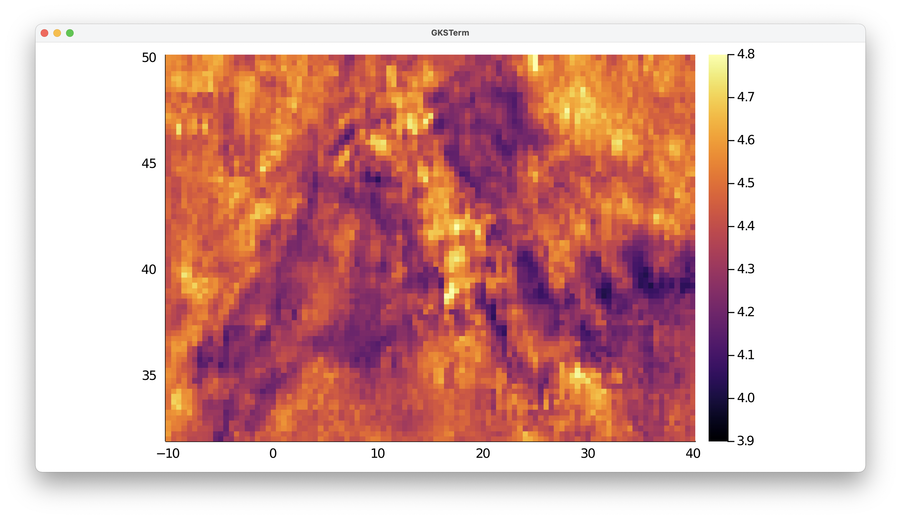

# 3D tomography model that is re-interpolated on a regular grid

## Goal
This explains how to load a 3D seismic data set that is given in CSV format (comma separated ASCII), and plot it in paraview. The example is a shear-wave velocity model of the Alpine-Mediterranean region, described in:

El-Sharkawy et al. (2020), *The Slab Puzzle of the Alpine‐Mediterranean Region: Insights from a new, High‐Resolution, Shear‐Wave Velocity Model of the Upper Mantle*, G$^3$ [https://doi.org/10.1029/2020GC008993](https://doi.org/10.1029/2020GC008993)

As the data is not given in a regular lon/lat grid, we first interpolate it to a different mesh.


## Steps
#### 1. Download data
The data is can be downloaded from [https://www.seismologie.ifg.uni-kiel.de/en/research/research-data/mere2020model](https://www.seismologie.ifg.uni-kiel.de/en/research/research-data/mere2020model). Do that and start julia from the directory where it was downloaded.

#### 2. Read data into Julia
The main data-file, `El-Sharkawy-etal-G3.2020_MeRE2020_Mediterranean.csv`, has 23 lines of comments (indicated with `#`), after which the data starts. We can use the build-in package `DelimitedFiles` to read in the data, and tell it that the data is separated by `|`. We also want the resulting data to be stored as double precision values (`Float64`), and the end of every line is a linebreak (`\n`).
```julia-repl
julia> using DelimitedFiles
julia> data=readdlm("El-Sharkawy-etal-G3.2020_MeRE2020_Mediterranean.csv",'|',Float64,'\n', skipstart=23,header=false)
3695678×4 Matrix{Float64}:
 32.12  -11.0    50.0  4.57
 36.36  -11.0    50.0  4.47
 38.32  -10.99   50.0  4.4
 49.77  -10.99   50.0  4.52
 29.82  -10.98   50.0  4.44
 34.1   -10.98   50.0  4.56
 40.26  -10.98   50.0  4.36
 42.19  -10.97   50.0  4.38
 44.1   -10.97   50.0  4.38
  ⋮
```
Next, extract vectors from it:
```
julia> lat  = data[:,1];
julia> lon  = data[:,2];
julia> depth=-data[:,3];
julia> Vs   = data[:,4];
```
Note that we put a minus sign in front of depth, as that is what `GeophysicalModelGenerator.jl` expects.

#### 3. Reformat the data

#### 3.1 Load and plot the data layout
The data is now available as a bunch of data points. In principle we can plot that in Paraview, but it is better to reformat it into a 3D grid.

Let's first have a look at how the data is distributed at a given depth level. For that, extract all points at 50 km depth and plot it (make sure you have the `Plots.l` package installed)
```julia
julia> ind=findall(x -> x==-50.0, depth)
julia> using Plots
julia> scatter(lon[ind],lat[ind],marker_z=Vs[ind], ylabel="latitude",xlabel="longitude",markersize=2.5, clims=(3.9, 4.8))
```
The result looks like this:


So this is somewhat regular but not entirely and in some areas data points are missing. It is possible to create a VTK mesh that exactly respects this data, but for that we need knowledge on how the points are connected in 3D. The comments in the file do not provide this information, which is why we interpolate it on a regular lon/lat grid here which uses the same depth levels as in the data.

We extract the available depth levels with
```julia
julia> Depth_vec = unique(depth)
301-element Vector{Float64}:
  -50.0
  -51.0
  -52.0
  -53.0
  -54.0
  -55.0
  -56.0
    ⋮
 -345.0
 -346.0
 -347.0
 -348.0
 -349.0
 -350.0
```
which shows that the data set goes from `[-350:1:-50]`.
Let's create a regular grid, which describes a somewhat smaller area than the data-points to ensure that we can do an interpolation without having to extrapolate

```julia
julia> using GeophysicalModelGenerator
julia> Lon,Lat,Depth     =   LonLatDepthGrid(-10:0.5:40,32:0.25:50,Depth_vec);
julia> size(Lon)
(101, 73, 301)
```
The last command shows the size of our new grid.

We can plot our new Lon/Lat grid on top of the previous data:
```julia
julia> scatter!(Lon[:,:,1],Lat[:,:,1],color=:white, markersize=1.5, markertype="+",legend=:none)
```


#### 3.2 Interpolate to a regular grid

Next, we need a method to interpolate the irregular datapoints @ a certain depth level to the white data points.

There are a number of ways to do this: 
- Using the nearest point to the regular grid points (by using the `nearest_point_indices` function) 
- Employ [GMT.jl](https://github.com/GenericMappingTools/GMT.jl)
- Use [GeoStats.jl](https://juliaearth.github.io/GeoStats.jl/stable/index.html).
  
In this example, we will employ `GeoStats`. If you haven't installed it yet, do that with
```julia
julia> ]
(@v1.6) pkg> add GeoStats
```
We will first show how to interpolate data @ 50 km depth.
```julia
julia> using GeoStats
julia> Cgrid = CartesianGrid((size(Lon,1),size(Lon,2)),(minimum(Lon),minimum(Lat)),(Lon[2,2,2]-Lon[1,1,1],Lat[2,2,2]-Lat[1,1,1]))
101×73 CartesianGrid{2,Float64}
  minimum: Point(-10.0, 32.0)
  maximum: Point(40.5, 50.25)
  spacing: (0.5, 0.25)
julia> coord = PointSet([lon[ind]'; lat[ind]'])
12278 PointSet{2,Float64}
  └─Point(-11.0, 32.12)
  └─Point(-11.0, 36.36)
  └─Point(-10.99, 38.32)
  └─Point(-10.99, 49.77)
  └─Point(-10.98, 29.82)
  ⋮
  └─Point(45.97, 42.91)
  └─Point(45.98, 37.22)
  └─Point(45.99, 42.07)
  └─Point(45.99, 46.76)
  └─Point(45.99, 50.52)
julia> Geo   = georef((Vs=Vs[ind],), coord)
12278 MeshData{2,Float64}
  variables (rank 0)
    └─Vs (Float64)
  domain: 12278 PointSet{2,Float64}
julia> P = EstimationProblem(Geo, Cgrid, :Vs)
2D EstimationProblem
  data:      12278 MeshData{2,Float64}
  domain:    101×73 CartesianGrid{2,Float64}
  variables: Vs (Float64)
julia> S   = IDW(:Vs => (distance=Euclidean(),neighbors=2));
julia> sol = solve(P, S)
```
Here, we interpolated the data based on the Euclidean distance. Other methods, such as Kriging, can be used as well.
Next, we can extract the data
```julia
julia>  sol_Vs = values(sol).Vs
julia>  Vs_2D  = reshape(sol_Vs, size(domain(sol)))
julia>  heatmap(Lon[:,1,1],Lat[1,:,1],Vs_2D', clims=(3.9, 4.8))
```


The final step is to repeat this procedure for all depth levels:
```julia
julia> Vs_3D = zeros(size(Depth));
julia> for iz=1:size(Depth,3)
          println("Depth = $(Depth[1,1,iz])")
          ind   = findall(x -> x==Depth[1,1,iz], depth)
          coord = PointSet([lon[ind]'; lat[ind]'])
          Geo   = georef((Vs=Vs[ind],), coord)
          P     = EstimationProblem(Geo, Cgrid, :Vs)
          S     = IDW(:Vs => (distance=Euclidean(),neighbors=2));
          sol   = solve(P, S)
          sol_Vs= values(sol).Vs
          Vs_2D = reshape(sol_Vs, size(domain(sol)))
          Vs_3D[:,:,iz] = Vs_2D;
        end
```

#### 4. Generate Paraview file
Once the 3D velocity matrix has been generated, producing a Paraview file is done with the following command
```julia
julia> using GeophysicalModelGenerator
julia> Data_set    =   GeoData(Lon,Lat,Depth,(Vs_km_s=Vs_3D,))
GeoData
  size  : (101, 73, 301)
  lon   ϵ [ -10.0 - 40.0]
  lat   ϵ [ 32.0 - 50.0]
  depth ϵ [ -350.0 km - -50.0 km]
  fields: (:Vs_km_s,)
julia> Write_Paraview(Data_set, "MeRe_ElSharkawy")
1-element Vector{String}:
 "MeRe_ElSharkawy.vts"
```


#### 5. Plotting data in Paraview
In paraview you can open the file and visualize it:


Note that we employ the perceptually uniform color map Barlow, which you can download [here](https://www.fabiocrameri.ch/colourmaps/).

If you want to clip the data set @ 200 km depth, you need to select the `Clip` tool, select `Sphere` as a clip type, set the center to `[0,0,0]` and set the radius to `6171` (=radius earth - 200 km).


#### 6. Julia script

The full julia script that does it all is given [here](https://github.com/JuliaGeodynamics/GeophysicalModelGenerator.jl/blob/main/tutorial/MeRe_ElSharkawy.jl). You need to be in the same directory as in the data file, after which you can run it in julia with
```julia
julia> include("MeRe_ElSharkawy.jl")
```
