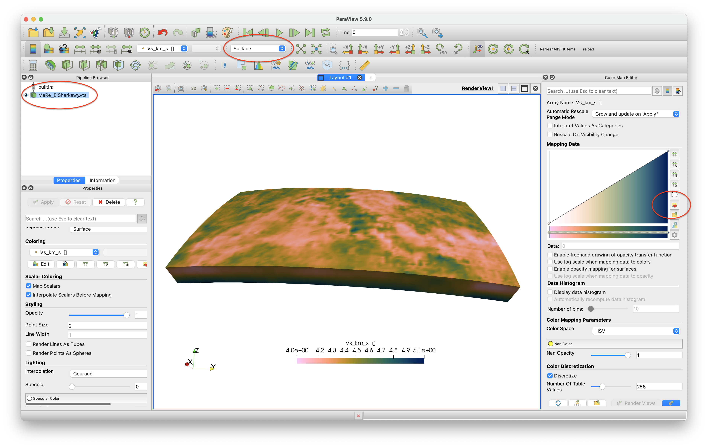
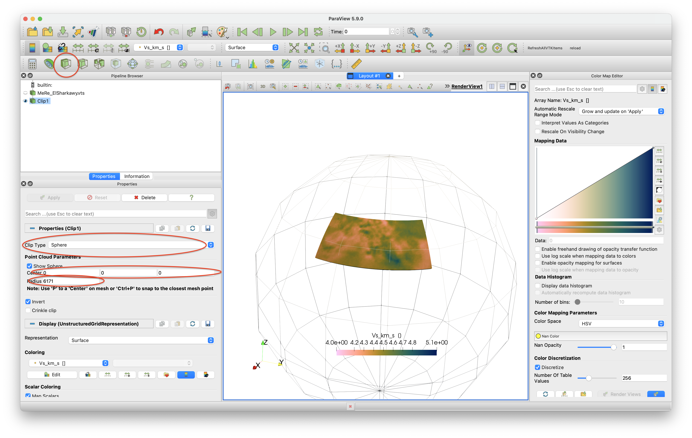

# 3D tomography model that is given as a netCDF file

## Goal
This explains how to load a 3D seismic data set that is given in netCDF format, and plot it in paraview. The example is a shear-wave velocity model of the Alpine-Mediterranean region, described in:

El-Sharkawy et al. (2020), *The Slab Puzzle of the Alpine‐Mediterranean Region: Insights from a new, High‐Resolution, Shear‐Wave Velocity Model of the Upper Mantle*, G$^3$ [https://doi.org/10.1029/2020GC008993](https://doi.org/10.1029/2020GC008993)


## Steps
#### 1. Download data
The data is can be downloaded from [https://ds.iris.edu/files/products/emc/emc-files/El-Sharkawy-etal-G3.2020-MeRE2020-Mediterranean-0.0.nc](https://ds.iris.edu/files/products/emc/emc-files/El-Sharkawy-etal-G3.2020-MeRE2020-Mediterranean-0.0.nc). Do that and start julia from the directory where it was downloaded.

#### 2. Read data into Julia
The main data-file, `El-Sharkawy-etal-G3.2020-MeRE2020-Mediterranean-0.0.nc`, is given as netCDF file. To read in data of this type, it is necessary to load an appropriate package. Here, we will use the [https://github.com/JuliaGeo/NetCDF.jl](NetCDF.jl) package. Download and install the package with:
 ```julia
julia> using Pkg
julia> Pkg.add("NetCDF")
```
First, let us have a look at the contents of this file (assuming that you are in the same directory where the file is located):
 ```julia
julia> using NetCDF
julia> filename = ("El-Sharkawy-etal-G3.2020-MeRE2020-Mediterranean-0.0.nc")
julia> ncinfo("El-Sharkawy-etal-G3.2020-MeRE2020-Mediterranean-0.0.nc")
##### NetCDF File #####

/Users/mthiel/PROJECTS/CURRENT/SPP2017/GeophysicalModelGenerator/InputData/El-Sharkawy/El-Sharkawy-etal-G3.2020-MeRE2020-Mediterranean-0.0.nc

##### Dimensions #####

Name                                                                            Length
--------------------------------------------------------------------------------------------------------------------------
depth                                                                           301
latitude                                                                        100
longitude                                                                       100

##### Variables #####

Name                                            Type                    Dimensions
--------------------------------------------------------------------------------------------------------------------------
depth                                           FLOAT                   depth
latitude                                        FLOAT                   latitude
longitude                                       FLOAT                   longitude
Vs                                              FLOAT                   longitude latitude depth

##### Attributes #####

Variable                      Name                          Value
--------------------------------------------------------------------------------------------------------------------------
global                        author_email                  amr.elsharkawy@ifg.uni-kiel.de
global                        data_revision                 r.0.0
global                        author_institution            Institute of Geosciences, University of Kiel, Otto-Hahn Pl..
global                        keywords                      seismic tomography, shear wave, Mediterranean, phase veloc..
global                        acknowledgment                Model was provided by Dr. El-Sharkawy, Institute of Geosci..
global                        history                       2020-09-29 14:37:43 UTC Converted to netCDF by GeoCSV_2_ne..
global                        repository_pid                doi:10.17611/dp/emc.2020.meresvelsh.1
global                        id                            MeRE2020
global                        author_name                   Amr EL-Sharkawy
global                        comment                       model converted to netCDF by IRIS EMC
global                        NCO                           netCDF Operators version 4.7.5 (Homepage = http://nco.sf.n..
global                        summary                       MeRE2020 is a high-resolution Shear‐wave velocity mod..
global                        repository_institution        IRIS DMC
global                        netCDF_file                   El-Sharkawy-etal-G3.2020-MeRE2020-Mediterranean-1.0.nc
global                        author_url                    https://www.seismologie.ifg.uni-kiel.de
global                        reference                     El-Sharkawy, et al. (2020)
global                        repository_name               EMC
global                        Conventions                   CF-1.0
global                        Metadata_Conventions          Unidata Dataset Discovery v1.0
global                        title                         The Slab Puzzle of the Alpine‐Mediterranean Region: I..
depth                         units                         km
depth                         long_name                     depth in km
depth                         display_name                  depth in km
depth                         positive                      down
latitude                      units                         degrees_north
latitude                      long_name                     Latitude; positive north
latitude                      standard_name                 latitude
longitude                     units                         degrees_east
longitude                     long_name                     Longitude; positive east
longitude                     standard_name                 longitude
Vs                            units                         km.s-1
Vs                            long_name                     Shear wave velocity
Vs                            display_name                  S Velocity (km/s)
```
As you can see, there is quite some information present in this file. The most important information here are the different variables stored in this file:

```julia
##### Variables #####

Name                                            Type                    Dimensions
--------------------------------------------------------------------------------------------------------------------------
depth                                           FLOAT                   depth
latitude                                        FLOAT                   latitude
longitude                                       FLOAT                   longitude
Vs                                              FLOAT                   longitude latitude depth
```
Here we can see that there are four variables in this file, three of them (`depth`,`latitude`, `longitude`) having a single dimension and the fourth one (`Vs`) having dimensions of the three previous variables. The three one-dimensional vectors therefore denote a regular grid of coordinates defining the locations where `Vs` is stored.
To load this data, we can now simply use the command *ncread*:
```julia
julia> lat = ncread(filename,"latitude")
julia> lon = ncread(filename,"longitude")
julia> depth = ncread(filename,"depth")
julia> Vs_3D = ncread(filename,"Vs")
julia> depth = -1 .* depth
```
Note that we multiplied depth with -1. This is necessary to make depth to be negative, as that is what `GeophysicalModelGenerator.jl` expects.

#### 3. Reformat the coordinate data
In the netCDF file, coordinates are given as 1D vectors denoting the location of nodes in a regular grid. However, `GeophysicalModelGenerator.jl` expects true 3D data, where each data point is assigned a latitude,longitude, depth and the respective property (here: `Vs`). To generate this full regular 3D grid, do the following:
```julia
julia> using GeophysicalModelGenerator
Lon3D,Lat3D,Depth3D = LonLatDepthGrid(lon, lat, depth);
```
#### 4. Generate Paraview file
Once the 3D coordinate matrix has been generated, producing a Paraview file is done with the following command
```julia
julia> Data_set = GeoData(Lon3D,Lat3D,Depth3D,(Vs_km_s=Vs_3D,))
GeoData
  size  : (100, 100, 301)
  lon   ϵ [ 29.0 - 51.0]
  lat   ϵ [ -11.0 - 45.9900016784668]
  depth ϵ [ -350.0 km - -50.0 km]
  fields: (:Vs_km_s,)
julia> Write_Paraview(Data_set, "MeRe_ElSharkawy")
1-element Vector{String}:
 "MeRe_ElSharkawy.vts"
```

#### 5. Plotting data in Paraview
In paraview you can open the file and visualize it:



Note that we employ the perceptually uniform color map Barlow, which you can download [here](https://www.fabiocrameri.ch/colourmaps/).

If you want to clip the data set @ 200 km depth, you need to select the `Clip` tool, select `Sphere` as a clip type, set the center to `[0,0,0]` and set the radius to `6171` (=radius earth - 200 km).



#### 6. Julia script

The full julia script that does it all is given [here](https://github.com/JuliaGeodynamics/GeophysicalModelGenerator.jl/blob/main/tutorials/MeRe_ElSharkawy.jl). You need to be in the same directory as in the data file, after which you can run it in julia with
```julia
julia> include("MeRe_ElSharkawy.jl")
```
