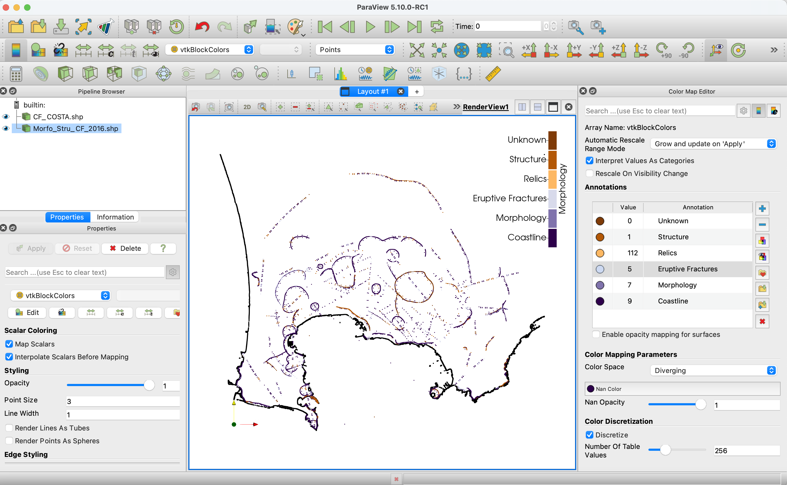
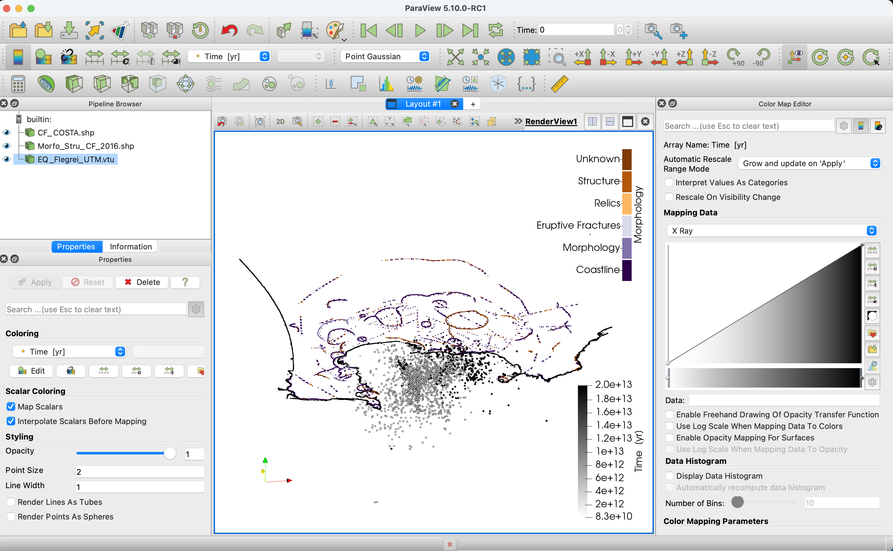
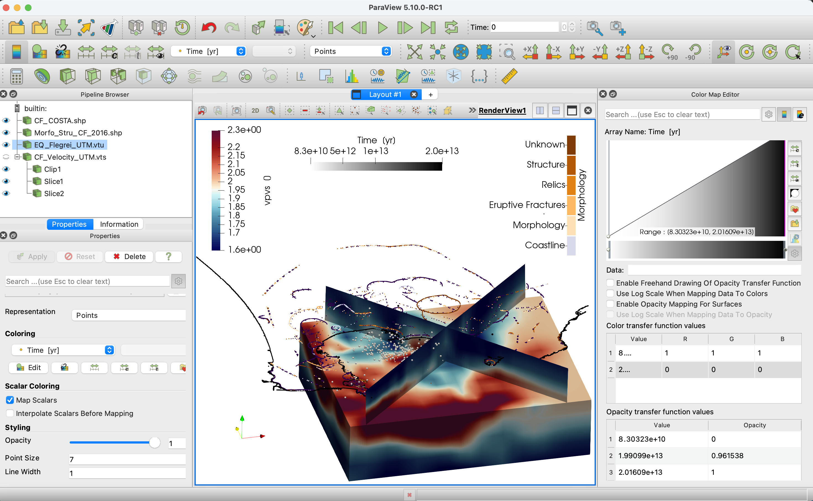
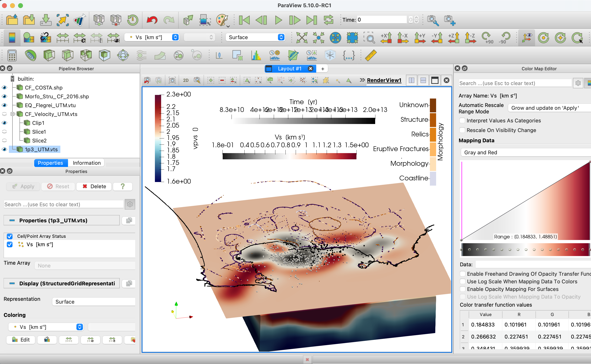

# Campi Flegrei Volcano tutorial using cartesian coordinates

## Goal

This tutorial visualizes available 3D data at a local volcano (Campi Flegrei caldera, Italy) using cartesian coordinates. This is done, e.g., when we only have geomorphological data in cartesian coordinates. It includes geological and geophysical data in UTM format from the following papers:

- Two shape files containing coastline and faults:
    - Vilardo, G., Ventura, G., Bellucci Sessa, E. and Terranova, C., 2013. Morphometry of the Campi Flegrei caldera (southern Italy). Journal of maps, 9(4), pp.635-640. doi:10.1080/17445647.2013.842508

- Earthquake data for two volcanic unrests, in 1983-84 and 2005-2016:
    - De Siena, L., Chiodini, G., Vilardo, G., Del Pezzo, E., Castellano, M., Colombelli, S., Tisato, N. and Ventura, G., 2017. Source and dynamics of a volcanic caldera unrest: Campi Flegrei, 1983–84. Scientific reports, 7(1), pp.1-13. doi:10.1038/s41598-017-08192-7

    - De Siena, L., Sammarco, C., Cornwell, D.G., La Rocca, M., Bianco, F., Zaccarelli, L. and Nakahara, H., 2018. Ambient seismic noise image of the structurally controlled heat and fluid feeder pathway at Campi Flegrei caldera. Geophysical Research Letters, 45(13), pp.6428-6436. doi:10.1029/2018GL078817

- Travel time tomography model:
    - Battaglia, Jean, Aldo Zollo, Jean Virieux, and Dario Dello Iacono, 2008. Merging active and passive data sets in traveltime tomography: the case study of Campi Flegrei caldera (Southern Italy). Geophysical Prospecting 56, no. 4: 555-573.  doi:10.1111/j.1365-2478.2007.00687.x

- Ambient noise tomography model:
    - Battaglia, Jean, Aldo Zollo, Jean Virieux, and Dario Dello Iacono, 2008. Merging active and passive data sets in traveltime tomography: the case study of Campi Flegrei caldera (Southern Italy). Geophysical Prospecting 56, no. 4: 555-573.  doi:10.1111/j.1365-2478.2007.00687.x


## Steps

#### 1. Download all data for region

You will need to download the zipped folder containing all files from [here](https://seafile.rlp.net/f/ff2c8424274c4d56b1f7/).

Make sure that you are in the unzipped directory.

#### 2. Geomorphology

Load both the the shape (.shp) files contained in `./Geomorphology/*.shp` inside Paraview. In the following figures we show the Cartesian representation (not geolocalized - left) and the UTM (UTM). Our shape files can only be loaded in the cartesian:



To reproduce it, represent the coastline as data points with black solid color and assign your favourite color map to the morphology. Note that each block color number corresponds to a different morphology. Beware that this file only works in cartesian coordinate, as it is still impossible to generate shape files in real UTM coordinates

#### 3. Earthquakes

Now let's plot earthquake data provided as text files. Start loading the data contained in `./SeismicLocations/*.txt`.
The first column gives us a temporal marker we can use to plot earthquakes in different periods.

```julia
julia> using DelimitedFiles, GeophysicalModelGenerator, Glob, GeoStats
julia> data_80s            = readdlm("SeismicLocations/Seismicity_UTM_1983_1984.txt", '\t', skipstart=0, header=false);
julia> data_00s            = readdlm("SeismicLocations/Seismicity_UTM_2005_2016.txt", ' ', skipstart=0, header=false);
julia> data                = vcat(data_80s,data_00s)        
julia> time                = data[:,1];
julia> WE                  = data[:,2];
julia> SN                  = data[:,3];
julia> depth               = data[:,4];
julia> EQ_Data_Cart        = CartData(WE,SN,depth,(Depth=depth * m,Time=time * yr,));
julia> Write_Paraview(EQ_Data_Cart, "CF_Earthquakes_Cartesian", PointsData=true)
julia> EQ_Data_UTM         = UTMData(WE, SN, depth, 33, true, (Depth=depth * m,Time=time * yr,));
julia> Data_set_UTM        =   convert(GeophysicalModelGenerator.GeoData,EQ_Data_UTM)
julia> Write_Paraview(Data_set_UTM, "CF_Earthquakes_UTM", PointsData=true)
```
Save in paraview with both cartesian and UTM formats. The final seismicity map looks like this:



The colour scale distinguishes earthquakes of different decades. Notice the progressive migration of recent seismicity (black dots) towards East.

#### 4. Velocity model

Using the Alps tutorial it is easy to create a paraview file from the Vp, Vs and Vp/Vs model in `./TravelTmeTomography/modvPS.dat` for both cartesian and UTM coordinates.

```julia
julia> using DelimitedFiles, GeophysicalModelGenerator
julia> data            =   readdlm("TravelTimeTomography/modvPS.dat", '\t', Float64, skipstart=0, header=false);
julia> WE              =   data[:,1];
julia> SN              =   data[:,2];
julia> depth           =   data[:,3];
julia> Vp              =   data[:,4];
julia> Vs              =   data[:,5];
julia> VpVs            =   data[:,6];
julia> resolution      =   (length(unique(depth)),  length(unique(SN)), length(unique(WE)))
julia> dim_perm        =   [3 2 1]
julia> we              =   permutedims(reshape(WE, resolution), dim_perm);
julia> sn              =   permutedims(reshape(SN, resolution), dim_perm);
julia> depth           =   permutedims(reshape(depth, resolution), dim_perm);
julia> Vp3d            =   permutedims(reshape(Vp, resolution), dim_perm);
julia> Vs3d            =   permutedims(reshape(Vs, resolution), dim_perm);
julia> Vp_Vs3d         =   permutedims(reshape(VpVs, resolution), dim_perm);
julia> Data_set_Cartesian  =   CartData(we, sn, depth, (vp = Vp3d * (km / s), vs = Vs3d * (km / s), vpvs = Vp_Vs3d,))
julia> Write_Paraview(Data_set_Cartesian, "CF_Velocity_Cartesian")
julia> Data_set        =   UTMData(we, sn, depth, 33, true, (vp = Vp3d * (km / s), vs = Vs3d * (km / s), vpvs = Vp_Vs3d,))
julia> Data_set_UTM    =   convert(GeophysicalModelGenerator.GeoData,Data_set)
julia> Write_Paraview(Data_set_UTM, "CF_Velocity_UTM")
```
Including the Vp/Vs model in the previous Paraview file workspace:



#### 5. Horizontal slices of shear velocity on irregular grid

Using ambient noise you can map shear wave velocity at different depths. The models at each depth are contained in the files `./NoiseTomography/*.txt`. We read them consecutively in a "for" loop:

```julia
julia> list_files = glob("AmbientNoiseTomography/*.txt");
julia> li         = size(list_files, 1);
julia> for i = 1:li
          nameFile   = list_files[i];
          name_vts   = name_vts[24:26];
          data       = readdlm(nameFile, '\t', Float64);
          WE         = data[:,1];
          SN         = data[:,2];
          depth      = data[:,3];
          Vs         = data[:,4];
```
However these models are too wide, so it is better to constrain them:

```julia
         findall( (WE .>= 419000) .& (WE.<=435000) .& (SN.>=4514000) .& (SN.<=4528000) );
         WE       = WE[ind];
         SN       = SN[ind];
         depth    = depth[ind];
         Vs       = Vs[ind];
```
Also, nodes are irregular, hence we create a 3D regular UTM:

```julia
        l                = length(WE);
        n_WE             = minimum(WE):100:maximum(WE);
        n_SN             = minimum(SN):100:maximum(SN);
        we, sn, Depth    = XYZGrid(n_WE, n_SN, depth[1]);
        Vs_3D            = zeros(size(Depth));
        Cgrid            = GeoStats.CartesianGrid((size(we, 1), size(we, 2)), (minimum(we), minimum(sn)), (we[2,2,1] - we[1,1,1], sn[2,2,1] - sn[1,1,1]))
        coord            = PointSet([WE[:]'; SN[:]']);
        Geo              = georef((Vs = Vs[:],), coord);
        P                = EstimationProblem(Geo, Cgrid, :Vs);
        S                = IDW(:Vs => (;neighbors=2));
        sol              = solve(P, S);
        sol_Vs           = values(sol).Vs;
        Vs_2D            = reshape(sol_Vs, size(domain(sol)));
        Vs_3D[:,:,1]     = Vs_2D;
        Data_set_Cart    = CartData(we, sn, Depth, (Vs = Vs_3D  * (km / s),))
        Write_Paraview(Data_set_Cart, "CF_Noise" * name_vts * "_Cartesian")
        Data_set         = UTMData(we, sn, Depth, 33, true, (Vs = Vs_3D*(km / s),));
        Data_set_UTM     = convert(GeophysicalModelGenerator.GeoData, Data_set);
        Write_Paraview(Data_set_UTM, "CF_Noise_UTM_"*name_vts)
    end
```
This is one of the horizontal sections created by the code in the previous model in both reference systems:



If you want to run the entire example, you can find the .jl code [here](https://github.com/JuliaGeodynamics/GeophysicalModelGenerator.jl/blob/main/tutorial/Tutorial_Flegrei.jl)