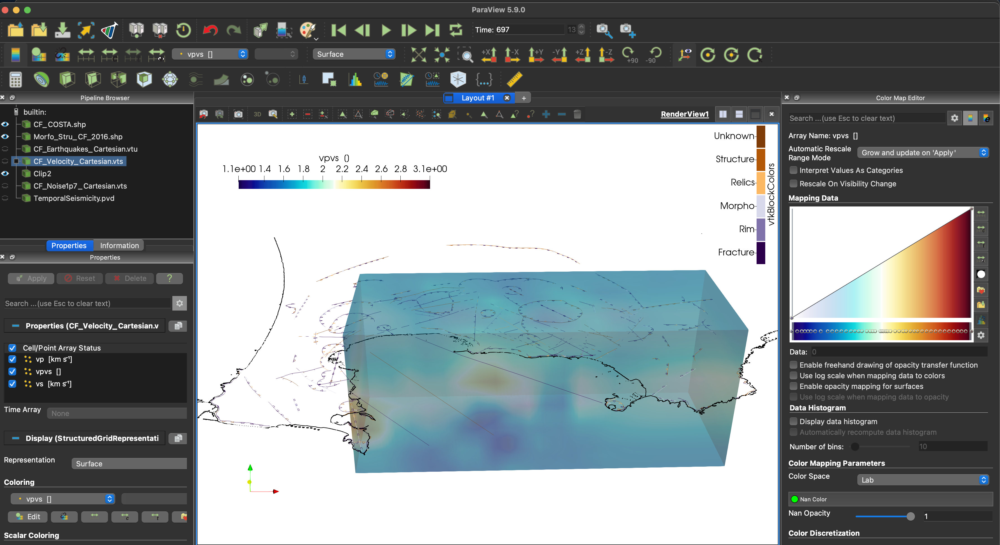
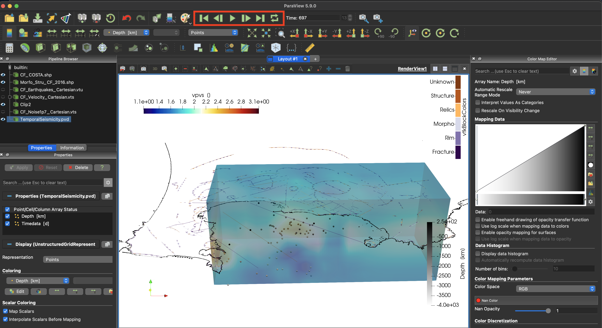

# How to create a movie to show seismic distribution through time

## Goal

This tutorial creates a movie of the spatial variations in seismicity using the earthquakes previously visualized at Campi Flegrei caldera. We visualize it against the travel-time model and tomography:

- Earthquake data for the 1983-84 unrest:
    - De Siena, L., Chiodini, G., Vilardo, G., Del Pezzo, E., Castellano, M., Colombelli, S., Tisato, N. and Ventura, G., 2017. Source and dynamics of a volcanic caldera unrest: Campi Flegrei, 1983–84. Scientific reports, 7(1), pp.1-13. doi:10.1038/s41598-017-08192-7

## Steps

#### 1. Download all data for region

You will need to download the zipped folder containing all files from [here](https://seafile.rlp.net/f/ff2c8424274c4d56b1f7/).

Make sure that you are in the unzipped directory.

#### 2. Geomorphology and velocity

Load both the the shape (.shp) files contained in "./Geomorphology/*.shp" inside Paraview. In the following figures we show the Cartesian representation (not geolocalized - left) and the UTM (UTM). Our shape files can only be loaded in the cartesian:



To reproduce it, represent the coastline as data points with black solid color and assign your favourite color map to the morphology. Note that each block color number corresponds to a different morphology. Beware that this file only works in cartesian coordinate, as it is still impossible to generate shape files in real UTM coordinates. To reproduce exactly the figure, you will need the velocity model loaded in the km-scale volcano tutorial.

#### 3. Earthquakes in movie

Create the folder **TemporalSeismicity** in the current folder and open the movie with the function *Movie_Paraview*.

```julia
julia> using DelimitedFiles, GeophysicalModelGenerator, Dates
julia> p2                  = @__FILE__;
julia> p2last              = findlast("/",p2);
julia> p3                  = chop(p2,head=0,tail = length(p2)-p2last[1]+1);
julia> output_path         = string(p3,"/");
julia> movie               = Movie_Paraview(name=string(p3,"/TemporalSeismicity"), Initialize=true);
julia> if isdir(string(p3,"/TemporalSeismicity"))==0
julia>     mkdir(string(p3,"/TemporalSeismicity"));
julia> end
```
Now let's load the earthquake data provided as text files. The first column gives us a temporal marker we can use to plot earthquakes in different periods. We used the *Date* package to transform this time into dates.

```julia
julia> data                = readdlm("SeismicLocations/Seismicity_UTM_1983_1984.txt", '\t', skipstart=0, header=false);
julia> l                   = length(data[:,1]);
julia> dates               = Date.(zeros(l,1))
julia> for i = 1:l
julia>     df              = DateFormat("yyyymmdd");
julia>     t1              = string("19",@sprintf("%5.o", data[i,1]));
julia>     t2              = Date(t1[1:8],df);
julia>     dates[i,1]      = t2;
julia> end
julia> WE                  = data[:,2];
julia> SN                  = data[:,3];
julia> depth               = data[:,4];
julia> dates_num           = dates - dates[1];
```
Select earthquakes every 50 days from the starting date (17/01/1983) and use them to create the frames for the video.

```julia
julia> nt                  = 50;
julia> dt                  = Dates.Day(nt);
julia> t                   = minimum(dates):dt:maximum(dates);
julia> for itime = 1:length(t)-1
julia>    name            = string(p3,"/TemporalSeismicity/", string(itime));
julia>    tt=findall(x->(x>=t[itime]) & (x<=t[itime+1]),dates);
julia>    we             = WE[tt];
julia>    sn             = SN[tt];
julia>    Depth1          = depth[tt];
julia>    DN              = dates_num[tt];
julia>    label_time      = Dates.value(DN[end]);
julia>    if size(tt,1)>1
julia>        Data_set    = CartData(we, sn, Depth1, 33, true, (Depth=Depth1*km,Timedata=DN));
julia>        movie       = Write_Paraview(Data_set, name,pvd=movie,time=label_time,PointsData=true);
julia>    end
julia>end
julia>Movie_Paraview(pvd=movie, Finalize=true)
```
This tutorial has created a new *TemporalSeismicity.pvd* that can be loaded in Paraview. 



Notice the animation panel, allowing you to run the video. You can select video speed by opening the *Animation View* under the *View* tab.


If you want to run the entire example, you can find the .jl code [here](https://github.com/JuliaGeodynamics/GeophysicalModelGenerator.jl/blob/main/tutorial/Tutorial_SeismicityTime.jl)