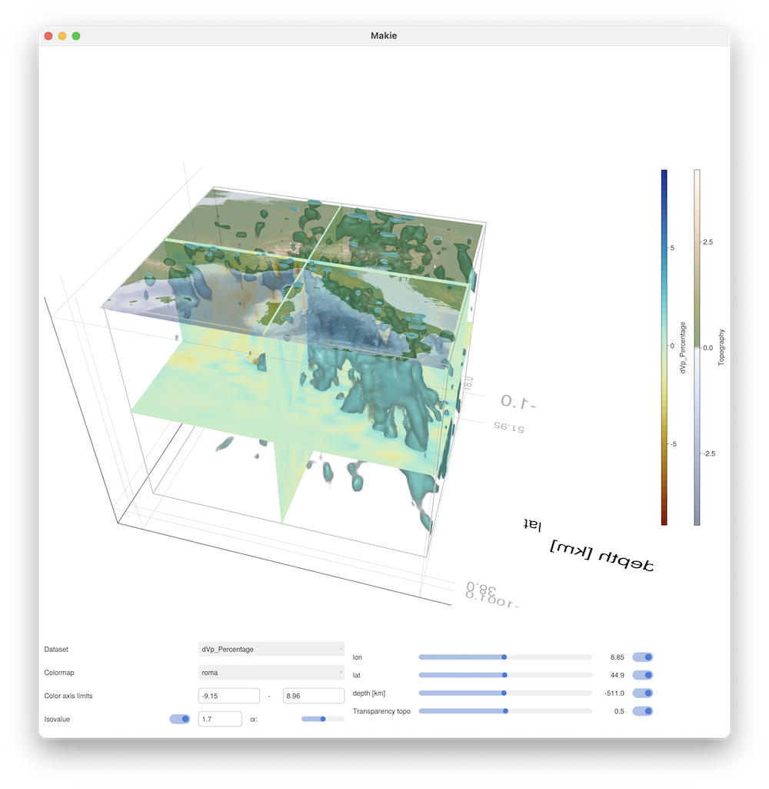

# Visualisation

The standard visualisation way of GMG is to generate Paraview (VTK) files & look at them there.
Yet, often we just want to have a quick look at the data without opening a new program.
For that reason, we created the `Visualise` widget, which uses `GLMakie` and allows you to explore the data.

It requires you to load both `GLMakie` and `GeophysicalModelGenerator`. A small example in which we load the tomography data of the alps is:
```julia
julia> using GeophysicalModelGenerator, GLMakie
julia> using GMT, JLD2
```
The last line loads packages we need to read in the pre-generated `JLD2` file (see the tutorials) and download topography from the region.
Lets load the data, by first moving to the correct directory (will likely be different on your machine).
```julia
julia> ;
shell> cd ~/Downloads/Zhao_etal_2016_data/      
```
Now you can use the `backspace` key to return to the `REPL`, where we will load the data
```julia
julia> Data = JLD2.load("Zhao_Pwave.jld2","Data_set_Zhao2016_Vp");    
```
At this stage you can look at it with
```julia
julia> Visualise(Data);    
```
Note that this tends to take a while, the first time you do this (faster afterwards).

Let's add topography to the plot as well, which requires us to first load that:
```julia
julia> Topo = ImportTopo([0,18,38,52], file="@earth_relief_01m.grd");
julia> Visualise(Data, Topography=Topo);    
```
Which will look like:



This is an example where we used `GeoData` to visualize results. Alternatively, we can also visualize results in km (often more useful for numerical modelling setups). For `Visualize` to work with this, we however need orthogonal cartesian data, which can be obtained by projecting both the data.
```julia
julia> p=ProjectionPoint(Lon=10, Lat=45)
ProjectionPoint(45.0, 10.0, 578815.302916711, 4.983436768349297e6, 32, true)
julia> Data_Cart  = CartData(XYZGrid(-600:10:600,-600:10:600,-1000:10:-1));
julia> Topo_Cart  = CartData(XYZGrid(-600:10:600,-600:10:600,0));
julia> Topo_Cart  = ProjectCartData(Topo_Cart, Topo, p)
CartData 
    size    : (121, 121, 1)
    x       ϵ [ -600.0 : 600.0]
    y       ϵ [ -600.0 : 600.0]
    z       ϵ [ -3.6270262031545473 : 3.654942280296281]
    fields  : (:Topography,)
  attributes: ["note"]
julia> Data_Cart  = ProjectCartData(Data_Cart, Data, p)
CartData 
    size    : (121, 121, 100)
    x       ϵ [ -600.0 : 600.0]
    y       ϵ [ -600.0 : 600.0]
    z       ϵ [ -1000.0 : -10.0]
    fields  : (:dVp_Percentage,)
  attributes: ["note"]
```
And once we have done that, you can visualize the data in the same way:
```julia
julia> Visualise(Data_Cart, Topography=Topo_Cart)
```

```@docs
Visualise
```